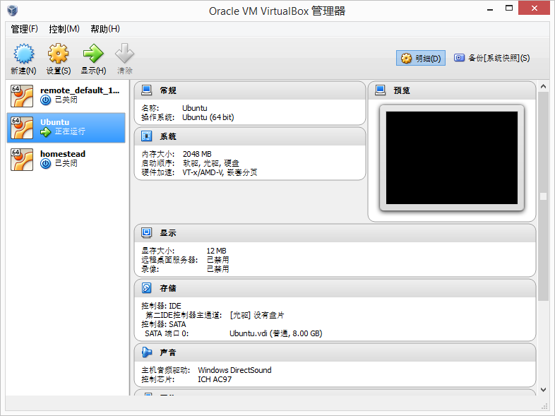
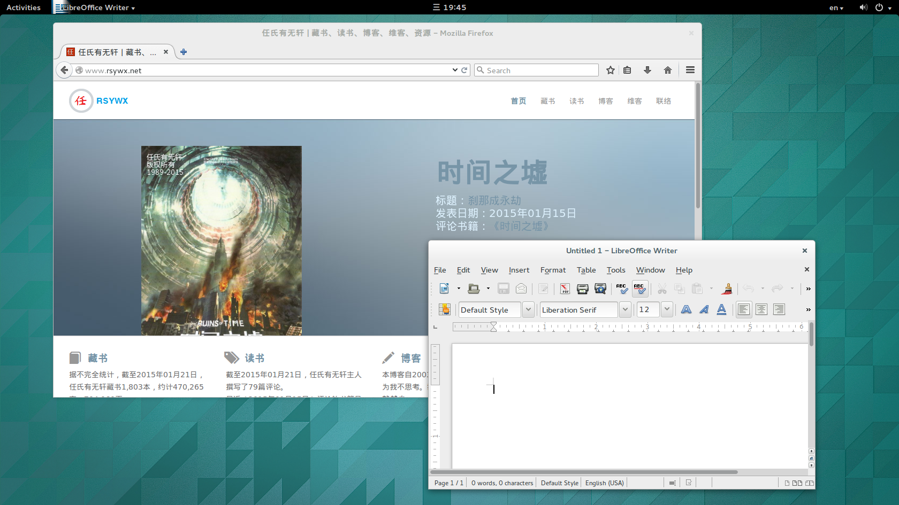

# 1.1 安装VBOX

作为开发人员来说，如果能有一台独立的电脑安装Linux操作系统作为开发机当然是很好的。不过，在大部分时候，我们一方面要在Windows系统下工作，一方面要同时进行Linux开发。而且为了方便，我们也许不愿意在两台机器中切换来切换去。

这时，我会推荐安装一个虚拟机，这台虚拟机当然是基于Linux/Ubuntu的，然后在这台虚拟机中继续LAMP其它组件和别的相关软件包的安装。

在Windows上我一般使用[Oracle VirtualBox](https://www.virtualbox.org/)。运行界面如下：

我安装了一个具有图形界面的Ubuntu并将其运行了起来：

安装好VBOX只是第一步。

接下来我们要安装的是Vagrant这个专门用来搭建虚拟环境的程序。