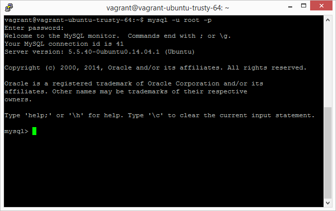

# 1.6 安装MySQL服务器

MySQL服务器的安装比较直接。我们不做详细讨论。

本书编写时所使用的MySQL服务器版本是5.5.40。你使用的MySQL版本不应该比这个低。

安装完成后，我们可以用`mysql -u root -p`命令，并输入`root`的密码来验证MySQL安装是否正确。

**注意：**这个`root`不是Ubuntu的`root`用户，而是在安装MySQL服务器时创建的MySQL的`root`用户。

一切顺利的话，你会看到这样的一个界面：

