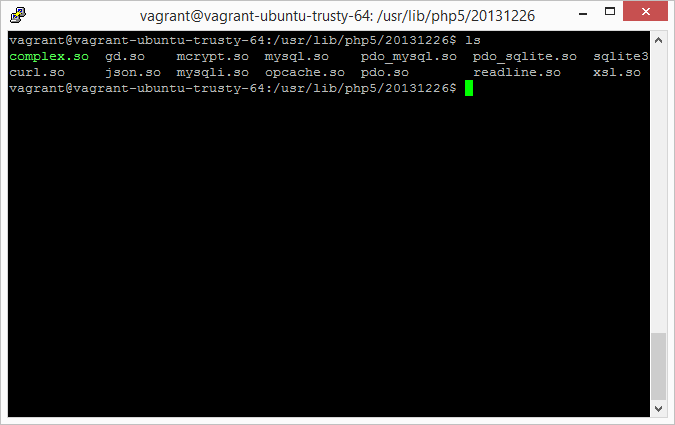

# 1.7 最后的微调

我们已经安装了Linux（Ubuntu），Apache，PHP和MySQL。至此，一个基本的LAMP结构已经搭建完成。但是我们还缺少最后关键的几步，将这几个单元有机地整合起来。

##1.7.1 对Apache的微调

我们需要对Apache进行的微调是使得它支持URL重写规则。这个是我们日后用Symfony编写应用并分发测试时必须的：

```
sudo a2enmod rewrite
```
该命令将使得Apache支持URL重写。

```
sudo service apache2 restart
```

该命令将重启Apache服务，我们刚才的改动从此生效。

##1.7.2 对PHP的微调

对PHP的微调分为几个方面。一个是对`php.ini`配置文件的修改，一个是添加一些PHP的挂接模块（特别是MySQL模块）。

一般而言，在安装好Apache之后再安装PHP，则PHP的安装过程中会自动挂接一个**`libapache2-mod-php5`**的Apache模块。在重启Apache之后，Apache就开始支持PHP脚本的解析。

如果PHP的安装没有自动挂接该Apache模块，我们可以手动安装：

```
sudo apt-get install libapache2-mod-php5
```
然后重启Apache服务使模块生效。

###1.7.2.1 修改`php.ini`

PHP的配置文件有两个，分别处理PHP在命令行中执行和在Apache中作为模块执行时的表现。由于我们是要进行Web开发，所以我们要修改的是所谓Web下的PHP配置文件。该文件位于`/etc/php5/apache2`，对其修改需要`root`权限（我们登录时使用的`vagrant`用户就具有`root`权限）。

一般而言，我们不用太多地修改这个文件，但是有这么几项还是需要进行改动的：

```
date.timezone = Asia/Shanghai 
;或者用UTC；或者你喜欢的时区

upload_max_filesize = 100M
;设置的这么大，是因为有时需要通过上传大图片

post_max_size = 100M
;这个值和上面这个值的设置最好保持一致
```

###1.7.2.2 PHP模块

PHP模块又称为PHP扩展，是一些可挂载的程序（在Linux系统下是`*.so`），为PHP语言本身提供更多的功能。有关PHP模块的开发，已经超出了本书的范围。有兴趣的读者可以参阅我写的系列教程：[第一部分](http://www.sitepoint.com/getting-started-php-extension-development-via-php-cpp/)，[第二部分](http://www.sitepoint.com/php-extension-development-php-cpp-object-oriented-code/)，[第三部分](http://www.sitepoint.com/developing-php-extensions-c-php-cpp-advanced/)。

到底要装哪些模块完全是个人喜好和开发要求决定，没有标准。

作为本书所讨论的Web应用，我选择安装了如下扩展：



这些扩展的具体介绍可以参见相关文档。

**注意：**`complex.so`是我自己开发的一个复数模块，你在别处找不到，只能根据我的教程自己编译。没有这个模块也不会影响我们后面的开发。

这些模块的安装都可以使用类似的方法。比如，我们要安装`mcrypt`这个扩展，那么我们这么做：

```
apt-cache search mcrypt | grep php
```
这个命令会给出如下的信息：

```
php-crypt-blowfish - Allows for quick two-way blowfish encryption without requiring the MCrypt PHP extension
php5-mcrypt - MCrypt module for php5
```
其中的`php5-mcrypt`就是我们要安装的扩展名。然后我们用：
```
sudo apt-get install php5-mcrypt
```
命令就可以完成安装和配置了。

模块安装完成后，建议重新启动Apache服务。

##1.7.3 对MySQL的微调

对MySQL的微调也分为两部分。一部分是和PHP的挂接，一部分是MySQL本身的微调。

###1.7.3.1 和PHP的挂接

我们安装了PHP，也安装了MySQL，但是我们还没有在PHP中挂接MySQL扩展。只有挂接了这个MySQL扩展，我们才能在我们的PHP程序中使用MySQL数据库的功能。

```
sudo apt-get install php5-mysql
```
如果觉得有必要，你也可以安装一个`phpmyadmin`来对MySQL数据库进行管理：

```
sudo apt-get install phpmyadmin
```

但是我们也可以远程来管理MySQL数据库。

###1.7.3.2 修改`my.cnf`

MySQL的配置文件是：`/etc/mysql/my.cnf`。

我们需要记住：我们在Windows机器上进行开发，通过Vagrant的文件夹共享将我们的修改直接映射到Vagrant盒子中。相对我们的Windows机器，这个盒子是“远程”的（因为我们的盒子设置中，其IP和我们Windows机器的IP不是一个，更不在一个网段）。

缺省情况下，MySQL只对本级的MySQL请求做出响应，因此无法进行远程管理。使用PHPMyAdmin虽然可以解决这个问题，但是我比较喜欢用**本地**GUI的程序来管理**远程**MySQL，所以需要设置MySQL以放开远程管理。

```
bind-address = 127.0.0.1
```
修改完毕后，使用如下命令重启MySQL服务：

```
sudo service mysql restart
```

在终端登录MySQL，输入如下命令：

```
grant all privileges on *.* to 'root'@'%' identified by 'password' with grant option
```

好了。经过这些修改后，我们在Windows机器中也可以用GUI程序来管理在Vagrant运行的MySQL服务器了。我个人使用的是Valentina Studio Pro（我为这个软件写过一篇[测评](http://www.sitepoint.com/look-valentina/)，所以获得了一个免费的专家版授权）。还有很多免费的GUI程序可以下载使用，比如MySQL官方推荐的[MySQL Workbench](http://www.mysql.com/products/workbench/)。

至此，我们的LAMP服务器设置基本完成——只有最后一步了：我们需要设置一个虚拟服务器来使得我们可以远程访问我们的站点。