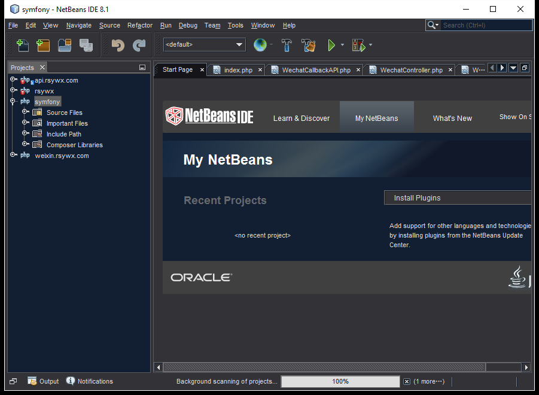

# 1.9 一个趁手的IDE

最后，我们需要一个趁手的IDE。

笔者使用的是[NetBeans]出品的NetBeans IDE。当前其版本是8.1。

我使用它的原因是：

1. 免费。
2. 丰富的插件。
3. 强大而实用的编辑器。
3. 速度尚可。
4. 提供一个Chrome插件[NetBeans Connector](https://chrome.google.com/webstore/detail/netbeans-connector/hafdlehgocfcodbgjnpecfajgkeejnaa?utm_source=chrome-app-launcher-info-dialog)方便我们在Chrome浏览器中进行调试。
5. 用惯了……

用户可以用自己更趁手的IDE进行本书中应用的开发。

在IDE的选择上，没有更好，只有更舒服！