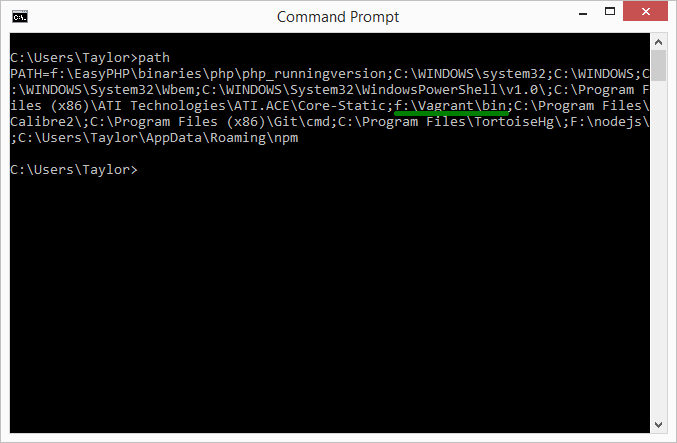

# 1.2 安装Vagrant

首先我们要做的，是到Vagrant官方站点去[下载](https://www.vagrantup.com/downloads.html)我们要用的Vagrant程序。

Vagrant的安装很直观，不用多做评论。在安装结束后，需要确定一件事情，就是保证你的Vagrant可执行程序的目录是在Windows的path内：

这样我们才能在我们所选定的目录中都能执行vagrant相关的命令。

下一节我们要讲述如何安装Ubuntu，配置一个Vagrant的环境（称为一个box）。

