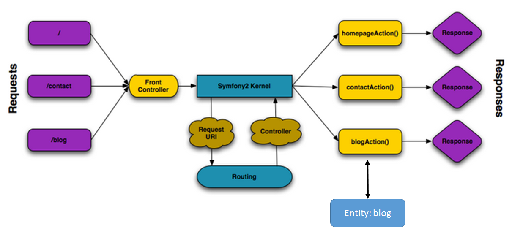
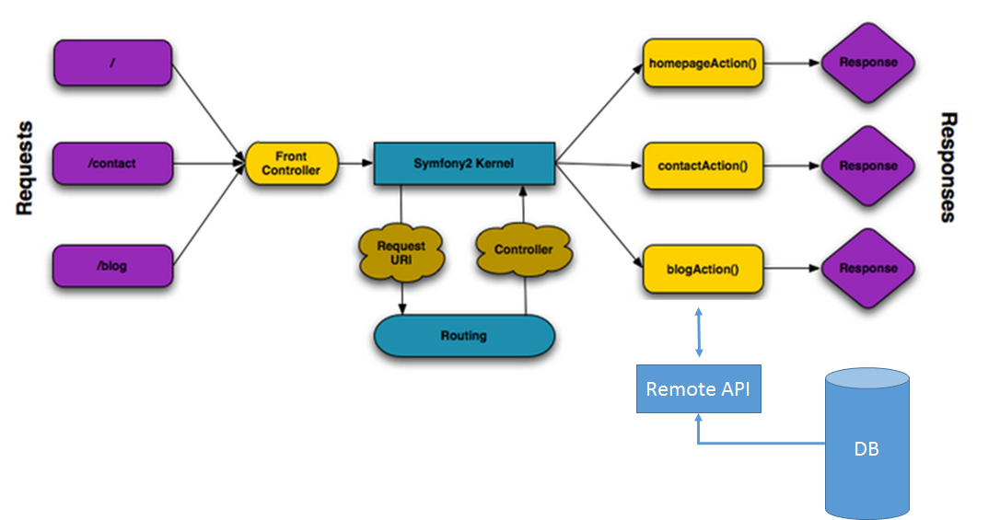

#03.01 MVC

SF3是基于MVC层次的。MVC层次很好地隔离了一个Web应用的各个不同层面：

* M(odel)：模型层，也可以理解为数据库接口层。这个层在PHP对象（类、成员）和数据库结构（表格 、字段）之间建立起一种映射关系。
* V(iew)：呈现层，或者叫展示层。我们可以简单地将其理解为我们在Web浏览器中看到的一个一个页面。
* C(ontroller)：控制层。它回到这样一个问题：**页面中的内容（特别是动态内容）应该从哪里来？**

SF3官方文档中有这么[一张图](http://symfony.com/doc/current/book/http_fundamentals.html)：

这里出现了C和V的代表，如`Front Controller`，`Controller`，`Response`等。没有出现的是M的代表。所以我们可以基于这张图来加以扩展：

这张图中的`Entity: blog`就是个M。在实际应用中，它应该是一个表格，保存了所有的blog的记录。某一个控制层的控制器（比如`blogAction`）向`blog`这个实体进行查询和其它操作。根据操作的不同，`blog`这个实体可能返回所有博客的列表，或者是经过筛选、排序过的列表等，也可能是CRUD中其它的操作。

**重要更新**：在之前的开发中，笔者都采用了标准的MVC模式。而在最新一次的升级开发中，笔者采用了更灵活、更去耦合化的方式。

在图示中我们看到，一个Controller不再直接和数据库/实体打交道，换句话说，在Controller中不再直接从数据库中获得数据，而是借由一个第三方（当然也是由笔者开发）的RESTful API封装层从数据库中获取数据并返回给调用的Controller。

这么做的好处有不少。

首先，Controller端的代码极为简化，统一为“准备参数、发起调用、获得返回、处理返回、显示模板”。而其中的调用过程变成单纯的调用远程API。

其次，API的开发和应用本身没有太大的关联，基本去耦合。

第三，API本身可以向外开放，获得复用。

