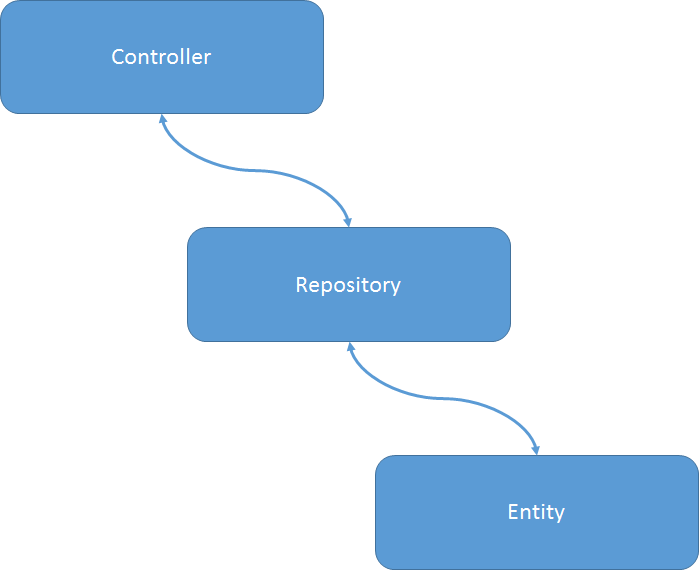

#03.06 仓库

Repository（代码仓库）是SF中的另一个重要概念。

顾名思义，代码仓库就是存放（通常是通用的）代码的地方。在SF中，一般用来堆放进行数据库操作的代码。

SF为什么要增加这么一个额外的层？有两个原因：

1. 虽然一个[实体](03.05 entity.md)提供了一些基本的数据库操作，如`findOneBy`之类的，但是肯定不能满足我们定制搜索的需要；
2. 如上的这个要求既不应该是Model的任务，更不应该是Controller的任务（不符合DRY和代码重用原则）。

所以，我们有必要加入一个新的层，形成这样的一个关系图：



1. Controller只提出我要什么数据；
2. Repository只负责选择数据；
3. Model存放真正的数据。

现在要马上透彻理解这里的关系和区别还是比较困难的。我们会在后续文章中更深入地讨论这些。

我们来看一个典型的仓库的代码：

```
<?php

namespace AppBundle\Repository;

use Doctrine\ORM\EntityRepository;
use Symfony\VarDumper;

/**
 * StatusRepo
 *
 * This class was generated by the Doctrine ORM. Add your own custom
 * repository methods below.
 */
class StatusRepo extends EntityRepository
{
	public function getStatusIn($start, $end, $count = 4)
    {
        $inter_s = new \DateInterval($start);
        $inter_e = new \DateInterval($end);

        $cts = new \DateTime();
        $cts->sub($inter_s);

        $cte = new \DateTime();
        $cte->sub($inter_e);

        $em     = $this->getEntityManager();
        $repo   = $em->getRepository('AppBundle:Status');
        $q      = $repo->createQueryBuilder('s')
                ->leftJoin('AppBundle:User', 'u', 'with', 'u=s.author')
                ->where('s.created>=:e')
                ->setParameter('e', $cte)
                ->andWhere('s.created<=:s')
                ->setParameter('s', $cts)
                ->setMaxResults($count)
                ->orderBy('s.created', 'desc')
                ->addOrderBy('s.id', 'desc')
                ->getQuery()
        ;
        $status = $q->getResult();

        return $status;
    }
} 
```

`getStatusIn`方法会提供在开始和结束期间的数据，缺省是提供4个。显然，这个数据的提供（搜索）不是简单地由`findBy`之类的实体方法可以完成的。

上面我们看到的构建SQL的方法是两种可用方法中的一种，即通过链接各个函数调用，在查询构造中中加入`join`、`where`、`order by`等限定而得到我们需要的一个`select`语句。

对其的调用在Controller中一般这样进行：

```
	public function indexAction()
    {
        $em        = $this->getDoctrine()->getManager();
        $repo      = $em->getRepository('AppBundle:Status');

        $day   = $repo->getStatusIn('P0D', 'P1D', 5);
        $week  = $repo->getStatusIn('P1D', 'P7D');
        $month = $repo->getStatusIn('P7D', 'P1M', 5);

		...	...

```

这几乎是一个标准的调用模式。

**重要更新**：如今的一种开发方式将我们从这样的重度耦合中解放了出来。因此不再需要Repository，而直接改用远程RESTful API的调用。详细的讨论可以参见[03.01 MVC](03.01 mvc.md)。