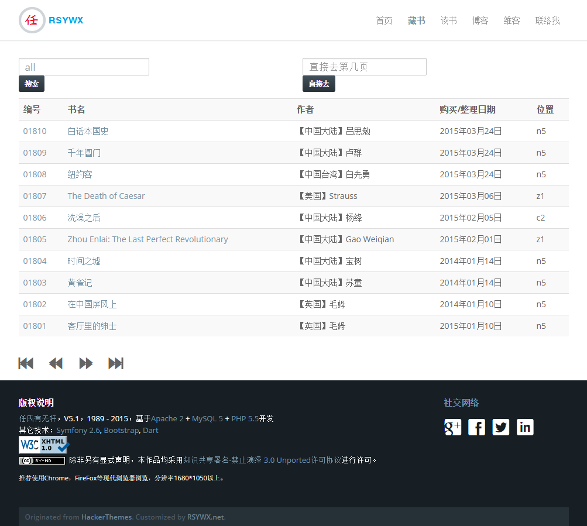
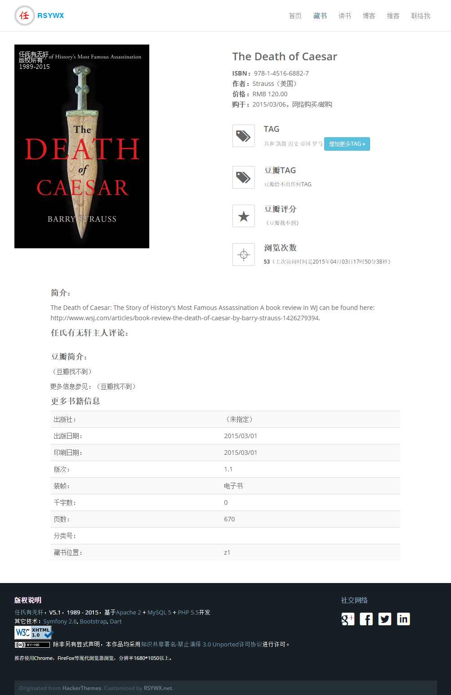
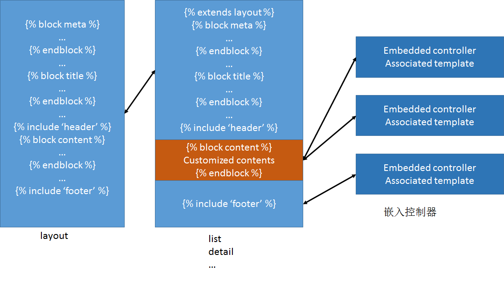

#03.07 模板

SF2缺省使用TWig引擎作为模板的渲染。

一般的应用，都会由不止一个页面构成。

比如我的藏书管理程序包括首页，藏书列表，书评列表和某本书的详情页面，也包括“和我联络”这样的页面。这些页面有些是动态页面，有些是静态页面。但是它们都有类似的布局。我采用的是最常见的“头+主体+尾”的三段式布局。如下两个页面分别是藏书列表和书籍详情页面：





很明显，头部的内容基本保持不变（站点标识，导航条），尾部的内容页基本不变（版权申明等）。变化的是中间主体的内容。如果是藏书列表，就应该是分页显示的书籍列表信息；如果是书籍详情，就显示某本书更详细的信息。

针对这样的布局，在模板设计时我们应该遵循DRY原则，将相似的部分抽取出来成为一个独立的部分并使得这些部分可以在不同的页面中重用。

Twig提供了丰富的功能来完成这些工作。

##`include`一个子模板

在我们刚才讨论的页面布局中，头（`header`）和尾(`footer`）是相对独立和固定的内容，所以可以作为独立的模板存在，并被包含入主模板。

因此，主模板（`layout.html.twig`）的书写大致是这样的：


```
<body>
    <!-- Header Section -->
    
    
    
    
</body>
```


是的，就这么简单。特别请注意`block content`到`endblock`这两行。这两行定义了一个名字为`content`的内容块，但是没有任何内容。这部分内容要由基于该主模板派生的各个模板去填充。

`include`模板还可以传递参数。比如下面的这个例子：

```
{{ include ("AppBundle:default:slider.html.twig", {'random':random}) }} 
```


这个指令在包含`slider.html.twig`模板的时候，也会同时将本模板中`random`这个变量传递到被包含的这个模板中的`random`变量，从而达到变量在两个模板中传递的目的。

`include`严格来说，是个控制结构，但是我们在上面的代码中看到了两种用法都是可行的。

##`extends`一个模板

上文定义的`layout`模板，只是一个框架，一般不会在我们的应用中单独呈现。我们要呈现给用户的页面都是基于这个模板派生而来。

我们来看一个比较简单的书籍列表的页面模板：


```
 

    <meta name="description" content="任氏有无轩书籍列表，第{{cur}}页，总{{total}}页。">
    <meta name="keyword" content="任氏有无轩,列表,索引">


任氏有无轩 | 藏书列表 | 第{{cur}}页，总{{total}}页


    <div class="widewrapper">
        <div class="container content">
            <div class="row">
                ......    
            </div>
            <div class="row">
                <section id="data" class="col-md-12">
                    <table class="table table-striped table-hover">
                        ......
                    </table>

                </section>
                <section id="pagination" class="col-md-12">
					......
                </section>
            </div>
        </div>
    </div>



```


最关键的是要`extends`一个主模板。然后在本模板中，针对主模板中定义的不同块（`block`），如果需要加以覆盖的，就用：`...`的语法加以重写。如果我们不覆盖主模板中的某个块，那么在本模板中会显示主模板中该快的内容。

##在模板中嵌入一个控制器

模板的第三种用法，也是比较高级的用法是在模板中嵌入一个控制器。

我们考虑我的藏书管理程序首页的一个用例。在该页面中，我需要在一个幻灯片效果中显示一本随机挑选的书，在另一处`<div>`中显示三本随机挑选的书。

一种常规的做法是，在显示首页的控制器（`AppBundle:Default:indexAction`）中，通过调用相关的仓库方法获得这些书，然后通过变量传递的方式传递给相应的模板，并在模板中显示。这样做是可以达到目的的。

但是这么做可能有问题。如果这样的显示要求是多个页面都要求的，我们会面临在A控制器中调用仓库方法然后获得数据传递给a模板；在B控制器中调用同一个仓库方法获得数据然后传递给b模板……的过程。这里有重复的过程：都要调用一个仓库方法。而且，假定这一方法调用后返回数据的呈现在不同模板中也是一样的，重复性会更大：我们需要在各个模板中`include`一个子模板，然后传递给这个子模板以数据。这个过程更繁琐。

因此，比较推荐的方法是，在模板中内嵌一个控制器，这个控制器负责获取数据并渲染一个模板，而该模板的渲染内容将嵌入当前调用模板中。

我们来看一个实例，是用来显示与一本书相关的tag的。

首先是当前模板（`detail.html.twig`）中对控制器的嵌入：


```
<div class="text">
	<h3>TAG</h3>
    <small></small>
    <a class="btn btn-info btn-sm" data-toggle="modal" href="#addtag" >增加更多TAG »</a><br/>
</div>
```


然后是显示某本书的tag的控制器：


```
	public function tagsbyidAction($id)
    {
        $em   = $this->getDoctrine()->getManager();
        $tags = $em->getRepository('AppBundle:BookBook')->getTagsByBookId($id);

        return $this->render('AppBundle:book:tags.html.twig', array('tags' => $tags));
    }
```


这里通过调用仓库的方法（`getTagsByBookId`），获得与这本书关联的tag数据，然后再通过`tags.html.twig`模板显示：


```

<a href="{{path('book_list', {'type':'tag', 'page':1, 'key':tag.tag})}}">{{tag.tag}}</a>

```


这样的安排是非常去耦合化的，便于程序的开发和维护。

##小结

由于Twig的语法相对简单，所以我们没有在之前的[Twig介绍](02.03 twig.md)和本节的介绍中过多着眼其语法的介绍——这部分会在后面的开发过程中结合实践逐一介绍——而更多地介绍Twig模板的设计过程和一些重要的概念。

我们以上讨论的内容可以用如下这张的图来说明：



