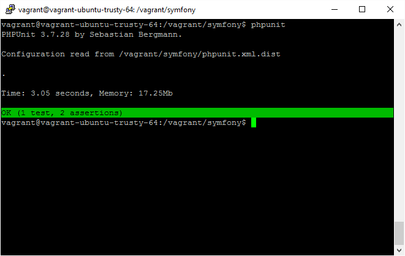

#03.08 测试

只要你编程，就一定有错误。

作为程序开发的一个基本要求，我们必须对程序是否能正确运行进行测试。在PHP的世界中，我们可以使用[PHPUnit](https://phpunit.de/)，它和Symfony的配合是非常好的。

测试分为两种，一种是单元测试（Unit Test），一种是功能测试（Functional Test）。PHPUnit可以配合SF3完成这两种测试。

具体的测试用例，我们会在后面编程的时候加以详细讨论。这里就不再展开。

另外，测试往往要用到很多测试数据，这就牵涉到样本数据的导入。我们也会在具体编程时加以讨论。

要在SF3的应用中使用PHPUnit，只要在根目录下运行：

```
phpunit
```

就可以了。

**注意：**我们假定PHPUnit的安装方式是全局的，同时`phpunit.xml`文件保存在项目根目录下（也就是和`composer.json`同一个目录）。

如果一切正常，那么会有一个类似如下的提示：


