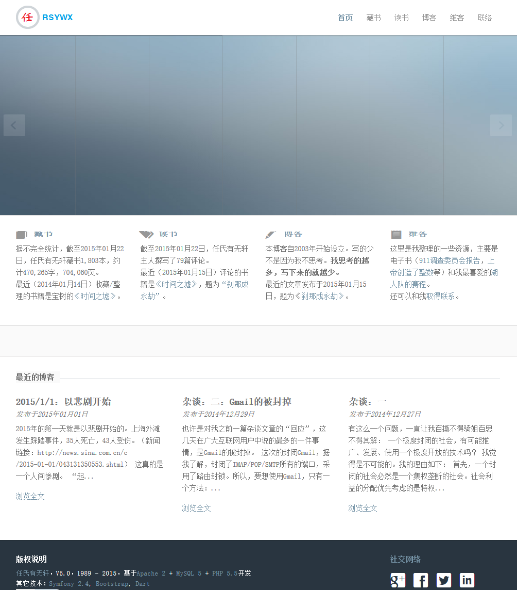

#04 藏书管理程序的结构

我们要开发的是一个主要供个人使用的藏书管理程序，该程序的实际运行版本见[“任氏有无轩”主页](http://www.rsywx.net)。

这个应用主要提供了这样一些功能：

* 书籍列表：显示藏书的一个列表，提供关键字搜索、页数跳转、分页显示等功能；
* 书籍详细：显示某一本书籍的详细信息，并从豆瓣处抓取信息作为补充显示，提供添加个人TAG的功能（以便访客日后搜索）；
* 读书心得：显示读书后写的心得（以博客文章形式呈现，牵涉到博客的整合，见以后的章节）；
* 博客：使用的是[WordPress](https://wordpress.org/)作为博客平台，并进行一些简单的WordPress API调用以获得信息。
* 维客：使用的是[DokuWiki](https://www.dokuwiki.org/dokuwiki)作为维客平台，只是整合，不做进一步编程。
* 资源：比如我喜欢的湖人队的赛程。
* 联系：列出一些和站点主人的联系方法，包括Google Map的调用等。
* 首页：提供站点的接口。
* 后台：提供一个后台入口，以比较直观的方式来管理数据。

在首页中，对书籍信息需要进行汇总并显示，有一个Dart的部件将显示“每日引言”和“今日天气”信息，列出最近的博客文章等。这是所有页面中编程量最大的页面（没有之一），而且又是站点的入口，因此将首先加以深入研究。我们先给出一张我的站点的首页截屏，作为效果展示：

