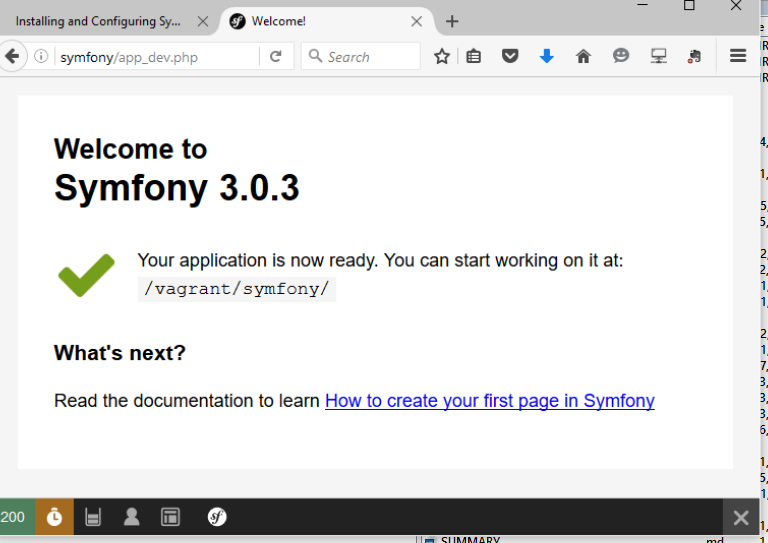

#05 创建应用

我们已经进行了大量的准备工作和前导阅读，目的当然就是为了我们接下来要进行的应用开发。

创建应用需要如下几个步骤。

##规划项目位置

我们之前看到了关于[Vagrant虚拟机的安装和如何进入虚拟机](01.03 install ubuntu.md)。

让我们先登录到虚拟机，并转到`/vagrant`目录。我们之前讲过，这个目录实际上就是我们Windows宿主机中的某个目录。

这个目录将成为我们所有项目的存放位置。在该目录下，各个项目有各自的项目目录。我们将这个项目目录称为某个项目的根目录。以后的教程中，如果再次提到这个“根目录”，那就一定是指这个目录。

##获得Symfony的`installer`

```
sudo curl -LsS http://symfony.com/installer -o /usr/local/bin/symfony
sudo chmod a+x /usr/local/bin/symfony
```
**注意：**这么做是在`/usr/local/bin`下创建了一个可执行的`symfony`命令。我比较喜欢将这个命令放置在`/vagrant`目录下。

##创建应用

假定我们在`/vagrant`目录，现在用如下的命令创建我们的应用：

```
$ symfony new the_new_project_name
```

请根据实际情况将`the_new_project_name`替换为更有意义的名字，在我们这本书中，我们用的项目名称`symfony`。

>**注意：**在我们虚拟机中，由于`/vagrant`这个目录并不是实实在在的Linux系统中的目录，而是一个Windows系统下映射过去的目录，上面的命令会执行出错。此时，我们可以在对应的Windows目录中进行如上操作。这样生成的应用框架是可以在Linux中使用的。

这个命令将在`vagrant`目录下创建一个`symfony`目录（也就是我们的项目名字），并在该目录下进行必要的设置，创建一个全新的Symfony应用框架。

现在我们进入`symfony`目录，也就是“根目录”中，按照之前“[Composer](02.04 composer.md)”一章中的介绍下载`composer.phar`，并执行一次更新。

##目录结构说明

一个空空如也的Symfony 2框架约莫有33M，这也是SF2被称为重量级框架的原因。它的目录结构如下：


###`app`目录

这个目录是整个框架的运行核心。一些重要的核心文件，如`autoload.php`，`APPKernel`，以及我们以后经常会用到的`console`文件都在该目录中。

它又包括几个子目录，也非常重要。

* `cache`：这是存放缓存的地方。根据当前环境不同，又会有`prod`，`dev`，`test`等不同的子目录。
* `logs`：这是应用日志存放的地方。
* `config`：这里存放应用所有的配置。在日后讨论中，我们会慢慢接触这些文件。

###`bin`目录

这里一般不会有什么内容。

###`src`目录

用户编写的所有内容都在该目录下，严格的说，是在`AppBundle`目录下。根据代码的用途，`AppBundle`目录下又可以分为：

* `Controller`：控制器，即MVC中的C。
* `Entity`：实体，即MVC中的M。
* `Repository`：仓库，存放实体操作的代码。
* `Resources\config`：存放当前应用包的配置，如路由，数据库实体等。
* `Resources\views`：存放模板，即MVC中的V。
* `Tests`：存放单元测试和功能测试代码。

###`vendor`目录

所有第三方的包和代码存放在此处。一般情况下我们在此处进行操作。

###`web`目录

这个目录是SF2应用开放给Web服务器的入口，也就是我们常规情况下访问`http://www.somewhere.com`时，Web服务器所访问的根目录。请不要和我们之前说的“项目根目录”混淆。

在这个目录中，有SF2应用的入口文件：`app.php`（生产模式）和`app_dev.php`（开发模式）。在实际应用中，我们访问的是`app.php`——当然，因为有重写规则的存在和该目录下`.htaccess`文件的配合，我们访问一个SF2应用时，不需要指明`app.php`，而可以直接用类似`http://www.somewhere.com/path/to/resource`这样的方式。在开发时，我们更多的是使用`app_dev.php`，此时我们访问的URI形如：**`http://www.somewhere.com/path/to/resource`**。

##远端调试

如果我们现在在Windows宿主机中访问`http://symfony/app_dev.php`，那么我们会看到一个错误信息：

>You are not allowed to access this file. Check app_dev.php for more information.

这是因为`app_dev.php`是个用在开发模式下的文件，缺省时开发环境是不对远程主机开放的。

既然我们采用目前的Windows+Vagrant的开发方式，我们显然必须进行远程开发，所以需要修改一下`app.php`文件：

原来的文件中找到这一段：
```
// This check prevents access to debug front controllers that are deployed by accident to production servers.
// Feel free to remove this, extend it, or make something more sophisticated.
if (isset($_SERVER['HTTP_CLIENT_IP'])
    || isset($_SERVER['HTTP_X_FORWARDED_FOR'])
    || !(in_array(@$_SERVER['REMOTE_ADDR'], array('127.0.0.1', 'fe80::1', '::1')) || php_sapi_name() === 'cli-server')
) {
    header('HTTP/1.0 403 Forbidden');
    exit('You are not allowed to access this file. Check '.basename(__FILE__).' for more information.');
}
```
将整个`if`段全部注释掉。然后再次访问，我们会看到如下的欢迎界面：



看到这个界面，那么我们的SF2应用创建就大功告成。接下来就是真正的开发过程了。

不过在进入开发之前，我们先要进行代码仓库的管理。