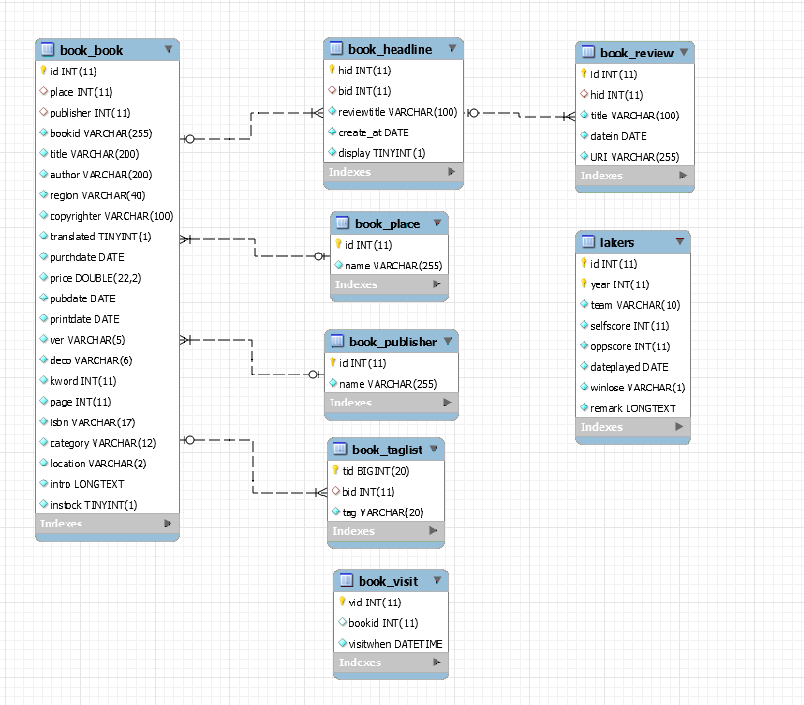

#建立数据库

数据库是任何现代应用的核心。我们要开发的藏书管理程序也不例外。

虽然当今编程有向着[TDD](http://en.wikipedia.org/wiki/Test-driven_development)，[DDD](http://en.wikipedia.org/wiki/Domain-driven_design)导向的趋势，但是在我们这个程序中，我们还是遵循最传统的从数据模型出发的流程。

如果我们去浏览Symfony 的官方文档，会发现SF3使用的是从实体（Entity）到数据库（Database）的流程。但是我们这个教程遵照的是一个完全不同的方向：所有数据的来源都是通过RESTful API提供的。换句话说，所有牵涉到数据库的操作都在另外一个应用中实现。关于这个RESTful API的实现，请参见我的另外一个教程[《用Silex开发一个RESTful API》](https://www.gitbook.com/book/taylorr/-silex-restful-api/welcome)中的讲解。

尽管如此，数据库还是整个应用的核心——即使在我们这个应用中不直接对其进行操作。

笔者已经将本应用使用到的数据库的结构SQL语句上传到了本书对应的Github仓库，请下载[该文件](https://github.com/taylorren/symfony/blob/master/sql/rsywx.sql)，并在你的开发环境中创建该数据库。

**注意**：在本文中的写作中，笔者使用的开发机已经有了一个名为`rsywx`的数据库——这是我生产环境使用的数据库的一个本地备份。所以，用于在笔者的开发环境中真正使用的数据库会是`rsywx_tutorial`。不过这不影响本教程的正常使用。读者可以使用`rsywx`也可以用自己喜欢的名字来命名这个数据库。

##数据库结构

`rsywx`数据库包括了若干表格。从功能来看，有收录书籍信息（以及书籍出版社、购买地点、Tag）的表格，收录书籍评论的表格以及书籍访问记录的表格，还有一个记录我最喜欢的NBA球队湖人队赛程的表格。

该数据库结构以及表之间的相互关系如下图所示：



我不去一一解释各个字段、各个表之间的关联，只是简单地说几句。

这是一个符合3NF的数据库。以`book_book`为核心，其他表格（除`lakers`）之外，都直接或间接地和该表有关联。

`book_visit`用来记录书籍详情页面被访问的情况。目前我只是简单地记录了书籍、访问时间。这些数据会在后台管理中用作各类统计。

这肯定不是一个完美的数据库设计。读者可以根据自己的需求加以改进和修订。

##数据库用户

一般来说，用`root`来操作数据库总不是一个很好的做法。在开发过程中也许可以出于简单化的考虑，我们可以先用`root`，但是在生产环境这样做是不推荐的——除非你对`root`的密码有充分信心。

我们可以借助相应的工具来创建一个新的用户，只给他相应的CRUD权限或者其它必要的权限。有关数据库用户创建和权限分配的操作，可以参见相应的文档。

在本文中，我们使用的用户和密码是：`tr/trtrtr`。这不是一个很好的用户/密码组合，不过只是作为开发和演示而已。

##修改数据库配置

SF应用中数据库配置保存在`app\config\parameters.yml`中。我们在安装SF、创建项目时可以制定数据库的连接，也可以在稍后手工修改。

```
# This file is auto-generated during the composer install
parameters:
    database_host: 127.0.0.1
    database_port: null
    database_name: rsywx_tutorial
    database_user: tr
    database_password: trtrtr
    mailer_transport: smtp
    mailer_host: 127.0.0.1
    mailer_user: null
    mailer_password: null
    secret: ThisTokenIsNotSoSecretChangeIt
```

我这里已经将使用到的数据库、用户、密码进行了更新。

这个文件也可以被当成“配置”文件，存放一些供整个应用使用的“全局”变量。我们会在后面的章节看到更详细的介绍。

