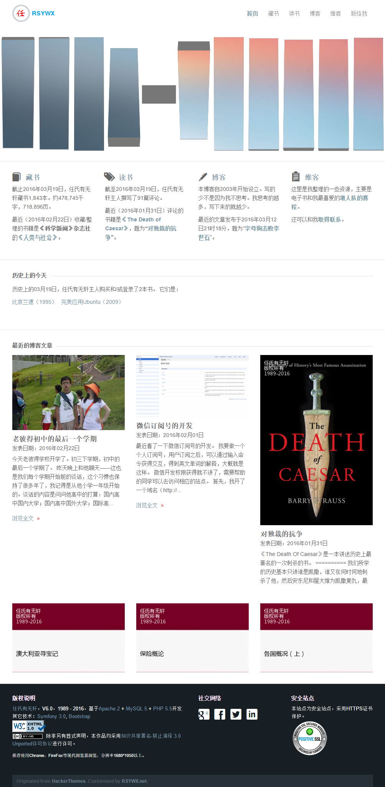
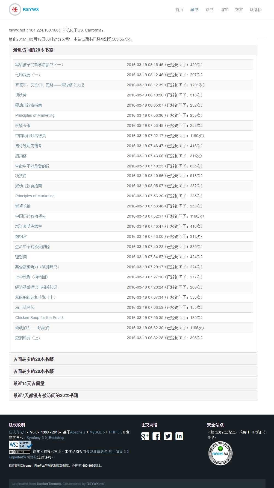

#应用结构

我们之前已经讲过，SF是一个非常严格的MVC框架。所以，我们的应用也严格遵循MVC分离的原则。

但是，由于本应用已经开发到了6.0版本，笔者对应用结构也有了全新的布局，所以在该版本的应用中，M模块其实已经不再存在，而改用RESTful API调用的方式。因此本应用的结构也相对比较扁平。

简单来说，我们创建了一系列的`Controller`，其中的`action`与`routing`关联，负责接收来自主入口文件（`app.php`）的调派。

在某个具体的`action`中，一般的流程是：

* 获取传入的参数；
* 构建要调用的API URI；
* 获得返回数据并解析[^1]；
* 将构造好的数据传递给一个模板并显示；

根据应用要提供的功能，我们可以创建相应的`controller`。我们会在稍后的章节中说明各个`controller`的创建。

这个应用有前台，也有后台。

前台是各个公共页面，如首页、书籍列表、书籍详情、书评列表、其它页面等。下图是首页的效果[^2]。

后台需要登陆，显示相关的统计数据，如下图所示。

[^1]: RESTful API接口返回的都是JSON格式的数据，所以必须将其转换到一个对象或者数组以便PHP进一步使用。

[^2]: 这是我运行中的站点的首页，比本教程要创建的首页更复杂。