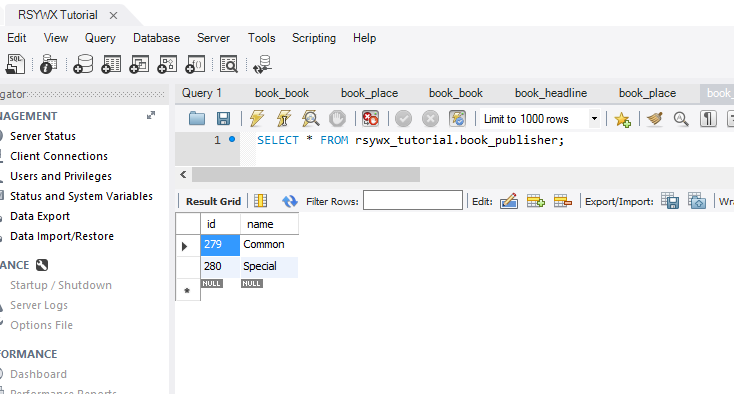

#样本数据

应用开发，其实有很大一部分是在样本数据的创建上。我们为什么要用样本数据？

首先，有了样本数据，我们的页面显示不会那么“空白”，有了比较实在的内容。

其次，样本数据一般都是非常有规则的，因此便于我们进行单元测试和功能测试。

第三，有一些应用上的逻辑问题，需要有足够的样本数据才会体现。比如我们在测试分页数据的时候。

如果我们只能人工或者半自动地往数据库中添加数据，那么效率就太低了。SF考虑到了这个问题，因此提供了一个专门的部件帮助我们来完成这个工作。这个部件就是`DoctrineFixturesBundle`。

##安装`DoctrineFixturesBundle`

按照SF官方文档的[说明](http://symfony.com/doc/current/bundles/DoctrineFixturesBundle/index.html)，该部件的分装有两步。

第一步，下载部件包。而这是通过运行如下命令完成的：

`composer require --dev doctrine/doctrine-fixtures-bundle`

下载安装完毕后，项目根目录下`composer.json`文件中会增加一行：

```
 "require-dev": {
...
        "doctrine/doctrine-fixtures-bundle": "^2.3" //这是增加的一行
    },
```

第二步，注册并激活该部件包。

找到`app/AppKernel.php`文件，并作如下修改：

```
// app/AppKernel.php
// ...

class AppKernel extends Kernel
{
    public function registerBundles()
    {
        // ...
        if (in_array($this->getEnvironment(), array('dev', 'test'))) {
            $bundles[] = new Doctrine\Bundle\FixturesBundle\DoctrineFixturesBundle();
        }

        return $bundles
    }

    // ...
}
```

从这段代码我们也可以看出，这个部件包只能使用在开发和测试环境中。这当然是很明显的。

##编写样本数据文件

首先我们要确定这些样本数据文件所在的文件夹。一般而言，如果我们用Doctrine的话，样本文件应该存放在`src/AppBundle/DataFixtures/ORM`之下。每个需要样本数据填充的表格都要有一个对应的样本文件。

我们先看一个比较简单的样本文件。该文件用来为`book_publisher`表格填充样本数据：

```
<?php

namespace AppBundle\DataFixtures\ORM;

use \Doctrine\Common\DataFixtures\AbstractFixture;
use \Doctrine\Common\DataFixtures\OrderedFixtureInterface;
use \Doctrine\Common\Persistence\ObjectManager;
use AppBundle\Entity\BookPublisher as BookPublisher;

class LoadPublisherData extends AbstractFixture implements OrderedFixtureInterface
{
    /**
     *
     * {@inheritDoc}
     */
    public function load(ObjectManager $manager)
    {
        //Create a common publisher
        $pub1=new BookPublisher();
        $pub1->setName('Common');
        $this->addReference('commonPub', $pub1);

        //Create a special publisher
        $pub2=new BookPublisher();
        $pub2->setName('Special');
        $this->addReference('specialPub', $pub2);

        $manager->persist($pub1);
        $manager->persist($pub2);

        $manager->flush();
    }

    /**
     *
     * {@inheritDoc}
     */
    public function getOrder()
    {
       return 1;
    }
}
```
我们首先约定本文件的命名空间。其次是四个`use`语句。这四个语句中，前三个是标准的，也是所有样本文件需要用到的。第四个（`use AppBundle\Entity\BookPublisher as BookPublisher;`）用到的命名空间是本样本文件需要操作的表格所对应的实体类。我们不对该实体类加以引用也是可以的，只是这样做的话，后面的代码中将要用到这个类的FQN（Fully Qualified Name）。

所有样本数据类都派生自`AbstractFixture`并实现了`OrderedFixtureInterface`接口。从这点我们可以看出，样本数据文件是有顺序的。这是因为，在数据库中，由于存在表格之间的依赖关系和引用一致性检查，有些表格的数据必须在另外一些表格的数据能得以填充之前先得到填充。

比如，`book_book`表格中的`publisher`字段是`book_publisher`的外键。基于引用一致性的要求，我们不能为`book_book.publisher`赋一个并不存在于`book_publiser.id`中的值。所以，我们必须先填充`book_publisher`表格才能再填充`book_book`表格中的数据。

类的实现中，至少必须有两个函数：一个是`load()`，一个是`getOrder()`。

`getOrder()`用来制定本样本类中的数据需要在第几位被填充。从上面的代码中可以看到，该样本数据是在第一位被填充，也就是我们首先在`book_publisher`中填充数据。

`load()`完成真正的数据填充。在上述代码中，我们创建了两个出版商的信息：一个被我们命名为"Common"，一个被命名为"Special"。

另外，由于我们已经知道这两个出版社一定会被`book_book`引用，所以我们用"`addReference()`"方法添加了各自的引用，以便我们在后续的样本文件中引用这两个对象。

最后我们持续化这两个新创建的出版社对象并保存到物理数据库中。

##数据填充

有了这个样本文件，我们就已经可以开始数据填充了。我们输入如下的命令：

`php bin/console doctrine:fixtures:load`

**注意**：每一次我们进行样本数据填充的工作，原来在数据库表格中的数据都会被清除。这是为了保证在开发和测试的时候所有原始的数据都是一致的。

数据填充完毕后，我们使用的数据库中就有了对应的数据。即以`book_publisher`为例，此时应该有两个数据：



##引用其它对象的样本文件

如前所述，`book_book`这个表格依赖其它表格数据，所以它不能第一个被填充，而且在填充的时候需要引用其它表格中的数据。

我们已经在上面看到，`book_publisher`表格的填充文件中创建了两个对象引用。类似的创建在`book_place`中也一样存在。

一旦我们完成了其它表格的填充和相应依赖对象的创建，我们就可以在`book_book`对应的样本文件中加以必要的引用而进一步创建`book_book`中的记录。

```
<?php
namespace AppBundle\DataFixtures\ORM;
use \Doctrine\Common\DataFixtures\AbstractFixture;
use \Doctrine\Common\DataFixtures\OrderedFixtureInterface;
use \Doctrine\Common\Persistence\ObjectManager;
use AppBundle\Entity\BookBook as BookBook;

class LoadBookData extends AbstractFixture implements OrderedFixtureInterface
{
    /**
     *
     * {@inheritDoc}
     */
    public function load(ObjectManager $manager)
    {
        //Now we create a 100 general book
        for ($i = 10000; $i <= 10099; $i++)
        {
            $p = new BookBook();
            $p->setAuthor('Normal');
            $p->setCategory('Normal');
            $p->setCopyrighter('');
            $p->setDeco('Normal');
            $p->setInstock(1);
            $p->setTitle('Normal Book Title');
            $p->setRegion('Normal');
            $p->setTranslated(0);
            $p->setPurchdate(new \DateTime());
            $p->setPubdate(new \DateTime());
            $p->setPrintdate(new \DateTime());
            $p->setVer('1.1');
            $p->setKword($i);
            $p->setPage($i);
            $p->setIsbn("$i");
            $p->setPrice("$i.99");
            $p->setLocation('a1');
            $p->setIntro('This is a normal book.');
            $p->setPublisher($this->getReference('commonPub'));
            $p->setPlace($this->getReference('commonPlace'));
            $p->setBookid("$i");
            $manager->persist($p);
        }

        //Create a special book
        $s = new BookBook();
        $s->setAuthor('Special');
        $s->setCategory('Special');
        $s->setCopyrighter('');
        $s->setDeco('Special');
        $s->setInstock(1);
        $s->setTitle('Special Book Title');
        $s->setRegion('Somewhere On Earth');
        $s->setTranslated(0);
        $s->setPurchdate(new \DateTime('1970-1-1'));
        $s->setPubdate(new \DateTime('1970-1-1'));
        $s->setPrintdate(new \DateTime('1970-1-1'));
        $s->setVer('1.1');
        $s->setKword(999);
        $s->setPage(999);
        $s->setIsbn('123456789');
        $s->setPrice('9999.99');
        $s->setLocation('x1');
        $s->setIntro('This is a very special book.\nIt is special because it is purchased at EPOCH.');
        $s->setPublisher($this->getReference('specialPub'));
        $s->setPlace($this->getReference('specialPlace'));
        $s->setBookid('99999');
        $this->addReference('aBook', $s);

        $manager->persist($s);
        $manager->flush();
    }
    /**
     *
     * {@inheritDoc}
     */
    public function getOrder()
    {
        return 3;
    }
}
```
在该样本文件中，我们一共创建了101本书。其中有100本是常规的，有1本是特殊的。

对于常规的图书，我们设置其相应的日期都是样本数据创建当日：

```
$p->setPurchdate(new \DateTime());
$p->setPubdate(new \DateTime());
$p->setPrintdate(new \DateTime());
```

我们在设置其购买地点和出版商时，用到了之前样本文件中创建的对象引用：

```
$p->setPublisher($this->getReference('commonPub'));
$p->setPlace($this->getReference('commonPlace'));
```

对于那本特殊的书，我们设置其相应的日期是一个很特别的日期，1970年1月1日，也就是计算机元年。其购买地点和出版商的设置也用到了之前样本文件中创建的对象引用：

```
$s->setPublisher($this->getReference('specialPub'));
$s->setPlace($this->getReference('specialPlace'));
```
最后，我们为这本特殊的书创建了一个对象引用。因为这本书的对象在后续的样本文件中还会用到。

##小结

样本数据填充部件是功能很强大的一个部件。它能帮助我们系统、高效地创建大量有组织、有规律的数据，方便今后的开发和调试。

样本填充文件采用PHP写成，所以不必麻烦开发人员再去熟悉一种新的方式或者语法。

笔者个人认为，开发初期使用样本数据填充绝对是事半功倍的。
