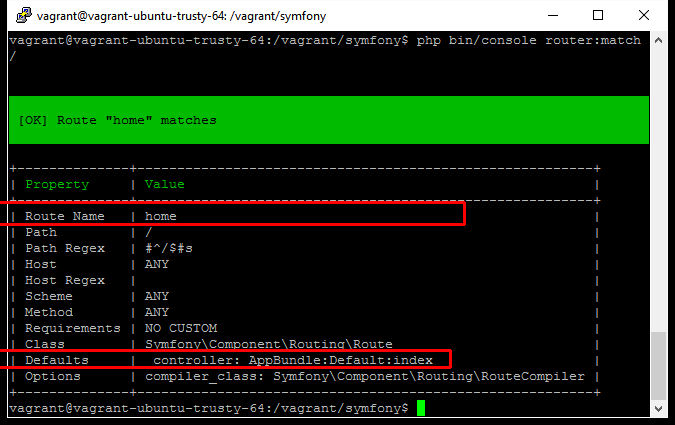

#路由

SF以及所有现代PHP框架都采用“单一入口”的方式。

所谓“单一入口”说的是，一个Web应用，不管要访问哪个资源和URI，都统一由一个单一的入口文件进行调派。在SF中，这个文件就是`web/app.php`（生产环境）或者`web/app_dev.php`（开发环境）。

在单一入口模式下，用户在浏览器中键入类似“`mysite/book/list`”这样的地址的时候，这样的请求会被入口文件处理，从中分离出不同的部分。在SF中，这样的部分可能包括：控制器（一个类）、动作（类方法）、参数等。

怎样来进行这个分离的动作呢？SF采用的是路由（router）的方法。

在SF中，定义路由有几种方式。比如注释方式（annotation）、YML方式等。我个人比较喜欢的是用YML的方式。

##定义入口路径

不管我们如何设计WEB应用，总是需要定义一个“入口”。

修改或者创建该文件 `src/AppBundle/Resources/config/routing.yml`，使之包含如下内容：

```
home:
    path: /
    defaults: { _controller: AppBundle:Default:index }    
```
同时修改`app/config/routing.yml`，使之只有如下内容：

```
rsywx:
    resource: "@AppBundle/Resources/config/routing.yml"
```

修改`app/config/routing.yml`的目的是向SF应用表明，我们的路由配置将来自`src/AppBundle/Resources/config/routing.yml`文件。这个文件是一个YML格式的文件，定义了我们应用中所要提供的所有资源的路径配置。

修改完毕后我们再次访问应用，浏览器将会显示我们之前看到的SF欢迎页面：


###路径配置

路径配置的核心包括三个部分：

1. 路径名。如`home`这样的一个名称。该名称必须在某个路径配置文件中唯一。
2. 路径。如`path: /`。该路径定义了应用能提供的URI。在本例中，我们定义的是入口，也就是通常所说的“首页”、“主页”。所以它的路径是`/`。我们在WEB中用`http(s)://sitename/`对该资源进行访问。
3. 动作。如`defaults: { _controller: AppBundle:Default:index }`。该动作表明，该路由将调用控制器的某个动作。该控制器位于`src/AppBundle/Controller/DefaultController.php`中，而调用的具体动作是`indexAction`方法。

由此，我们得到此类路径动作的一个重要约定。SF在寻找动作的时候，会在指定的Bundle（本例中的`AppBundle`目录，即`src/AppBundle`的控制器目录（即`src/AppBundle/Controller`）下寻找一个名为“`类名+Controller.php`”的文件（即`DefaultController.php`），并在其中寻找一个名为“`类名+Controller`”的类（即`class DefaultContrller`），再在其中找到一个“`动作名+Action`”的公共方法（即`public function indexAction`）并加以调用。

我们略微看一些这个控制器文件：

```
<?php

namespace AppBundle\Controller;

class DefaultController extends Controller
{
    public function indexAction(Request $request)
    {
        // replace this example code with whatever you need
        return $this->render('default/index.html.twig', [
            'base_dir' => realpath($this->getParameter('kernel.root_dir').'/..'),
        ]);
    }
}

```
我们在以后还会详细解释控制器的编写。这里只是简单地提一句：**一般情况下，一个控制器中的动作都会返回一个模板的渲染**，于是浏览器就有内容加以显示。

###两个重要的命令

在深入讨论更多路由配置之前，我们先看两个SF提供的和路由密切相关的命令。

###路由匹配

总有一天，我们的路由配置会越来越复杂，于是我们会产生疑惑（应用也可能产生bug）：某个URI到底匹配哪个路由？其匹配的路由到底是不是我们原先设计中想要的呢？

我们可以使用`php bin/console router:match`命令来对一个URI匹配哪个路由进行调试。比如对`/`路由的调试命令为：

```
php bin/console router:match /
```
该命令会产生如下输出：



可见，如我们的设计，`/`匹配了我们定义的`home`路由，它所调用的正是我们规定的`AppBundle:Default:index`动作。

###路由调试

有时，我们需要知道在应用中到底定义了多少路由，这时我们可以用如下的命令:

```
php bin/console debug:router
```
该命令将列出所有的路径名、调用方法（是`POST`、`GET`或者其它还是无所谓）、协议（比如是不是必须是https）、主机（可以由哪些主机对此访问）和路径。

