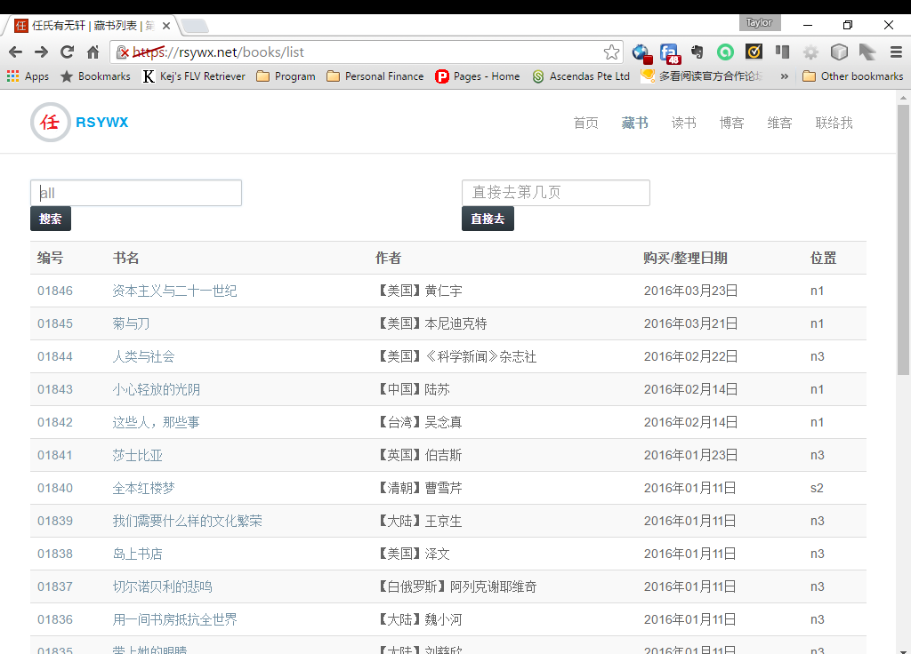
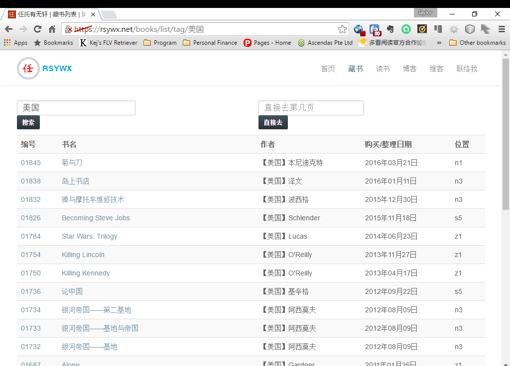

#路由

SF以及所有现代PHP框架都采用“单一入口”的方式。

所谓“单一入口”说的是，一个Web应用，不管要访问哪个资源和URI，都统一由一个单一的入口文件进行调派。在SF中，这个文件就是`web/app.php`（生产环境）或者`web/app_dev.php`（开发环境）。

在单一入口模式下，用户在浏览器中键入类似“`mysite/book/list`”这样的地址的时候，这样的请求会被入口文件处理，从中分离出不同的部分。在SF中，这样的部分可能包括：控制器（一个类）、动作（类方法）、参数等。

怎样来进行这个分离的动作呢？SF采用的是路由（router）的方法。

在SF中，定义路由有几种方式。比如注释方式（annotation）、YML、XML、PHP等。我个人比较喜欢的是用YML的方式。

##定义入口路径

不管我们如何设计WEB应用，总是需要定义一个“入口”。

修改或者创建该文件 `src/AppBundle/Resources/config/routing.yml`，使之包含如下内容：

```
home:
    path: /
    defaults: { _controller: AppBundle:Default:index }    
```
同时修改`app/config/routing.yml`，使之只有如下内容：

```
rsywx:
    resource: "@AppBundle/Resources/config/routing.yml"
```

修改`app/config/routing.yml`的目的是向SF应用表明，我们的路由配置将来自`src/AppBundle/Resources/config/routing.yml`文件。这个文件是一个YML格式的文件，定义了我们应用中所要提供的所有资源的路径配置。

修改完毕后我们再次访问应用，浏览器将会显示我们之前看到的SF欢迎页面：


##路径配置

路径配置的核心包括三个部分：

1. 路径名。如`home`这样的一个名称。该名称必须在某个路径配置文件中唯一。
2. 路径。如`path: /`。该路径定义了应用能提供的URI。在本例中，我们定义的是入口，也就是通常所说的“首页”、“主页”。所以它的路径是`/`。我们在WEB中用`http(s)://sitename/`对该资源进行访问。
3. 动作。如`defaults: { _controller: AppBundle:Default:index }`。该动作表明，该路由将调用控制器的某个动作。该控制器位于`src/AppBundle/Controller/DefaultController.php`中，而调用的具体动作是`indexAction`方法。

由此，我们得到此类路径动作的一个重要约定。SF在寻找动作的时候，会在指定的Bundle（本例中的`AppBundle`目录，即`src/AppBundle`的控制器目录（即`src/AppBundle/Controller`）下寻找一个名为“`类名+Controller.php`”的文件（即`DefaultController.php`），并在其中寻找一个名为“`类名+Controller`”的类（即`class DefaultContrller`），再在其中找到一个“`动作名+Action`”的公共方法（即`public function indexAction`）并加以调用。

我们略微看一些这个控制器文件：

```
<?php

namespace AppBundle\Controller;

class DefaultController extends Controller
{
    public function indexAction(Request $request)
    {
        // replace this example code with whatever you need
        return $this->render('default/index.html.twig', [
            'base_dir' => realpath($this->getParameter('kernel.root_dir').'/..'),
        ]);
    }
}

```
我们在以后还会详细解释控制器的编写。这里只是简单地提一句：**一般情况下，一个控制器中的动作都会返回一个模板的渲染**，于是浏览器就有内容加以显示。

##两个重要的命令

在深入讨论更多路由配置之前，我们先看两个SF提供的和路由密切相关的命令。

##路由匹配

总有一天，我们的路由配置会越来越复杂，于是我们会产生疑惑（应用也可能产生bug）：某个URI到底匹配哪个路由？其匹配的路由到底是不是我们原先设计中想要的呢？

我们可以使用`php bin/console router:match`命令来对一个URI匹配哪个路由进行调试。比如对`/`路由的调试命令为：

```
php bin/console router:match /
```
该命令会产生如下输出：


可见，如我们的设计，`/`匹配了我们定义的`home`路由，它所调用的正是我们规定的`AppBundle:Default:index`动作。

##路由调试

有时，我们需要知道在应用中到底定义了多少路由，这时我们可以用如下的命令:

```
php bin/console debug:router
```
该命令将列出所有的路径名、调用方法（是`POST`、`GET`或者其它还是无所谓）、协议（比如是不是必须要求https）、主机（可以由哪些主机对此访问）和路径。


##更多的路由配置

我们再来看几个路由，以了解更多的路由配置。

在这个藏书管理程序中，有一个功能是书籍列表（分页）。该路由定义如下：

```
book_list:
    path: /books/list/{type}/{key}/{page}
    defaults:
        page: 1
        type: title
        key: all
        _controller: AppBundle:Book:list

```

SF采用`{...}`来标记路径中的参数。在上例的路由中，其路径有三个参数：

* `type`：确定书籍列表的类型。一种是列书名，一种是列tag（更多的说明见后续章节）；
* `key`：如果`type`是列书名，这里就是书名的开始部分；如果`type`是列tag，这里就是一个tag；
* `page`：确定要显示第几页。

因此用这样一个单一的路径，我们可以可以显示三种不同的书籍列表：

1. 不带任何参数，或者参数为缺省值，那么列出所有藏书（按照`id`降序，亦即最新登录的书籍最先展示）的第一页。
2. 按照书名开头进行搜索，显示匹配书名开头部分的那些书籍。
3. 按照tag进行搜索，显示匹配tag的那些书籍。

在我的网站中，这些页面的效果如下所示[^1]：





我们需要注意的是浏览器地址栏显示的地址。还有就是，虽然这是三个不同的动作，但是它们使用的显示模板是一样的。

在该路由的配置中，其`defaults`段和之前的不同。除了按照常规要制定一个控制器和动作外，我们对该路由的路径中出现的三个参数设置了一个缺省值。所以我们在访问`books/list`的时候，实际上就是访问了`/books/list/title/all/1`。

##只能进行`POST`访问的路径

该应用中还有一些路径是用来处理表单输入的。对于这样的路径，我们不希望用户在浏览器中直接输入URI而进行误操作，所以需要对该路径可以通过怎样的方法进行访问加以限制。

比如下面这个为一本书增加tag的路径：

```
tags_add:
  path: /books/addtag
  defaults: {_controller: AppBundle:Book:tagsAdd}
  requirements: 
    _method: POST   
```
这里我们设置了路由的一些额外要求。其中的`_method: POST`规定该路由只能通过`POST`方式访问。

##对参数的限制

我们有一个书籍详情的页面，列出书籍的详细信息。该路径定义如下：

```
book_detail:
    path: /books/{id}.html
    defaults: { _controller: AppBundle:Book:detail }    
```
于是我们就可以用类似`/books/00005.html`这样的方式来访问一本书籍。但是这么做有一个小问题。

在我们的数据库中，一本书的`bookid`有5位，按照约定，它应该都是数字并有前导0，比如`00666`，`01234`等。类似`1234`（位数不够），`abcd8`（混杂了字母）这样的参数是不合理的。如果用上述的这个路径定义，我们访问`/books/1234.html`的时候，也还会匹配到上面的那个路径。这样做不会有什么致命的后果，只是数据库中无法找到这本书，显示一个“该书籍找不到”的页面而已[^2]。但是这样不是很好的方法，如果我们能对路径中参数加以限制，使得那些不符合要求的参数（和URI）根本不访问该路由，我们至少解决了部分问题。

于是我们要对该路由中参数`id`加以限制。我们修改上述路由为：

```
book_detail:
    path: /books/{id}.html
    defaults: { _controller: AppBundle:Book:detail }    
    requirements:
        id: \d{5}
```
通过一个简单的正则表达式，我们约定`id`这个参数必须是5位数字，因此类似`1234`，`abcd8`这样的参数将不会触发这个路径。访问这样的URI只会出现一个Apache自身的404页面。

我个人认为，我会比较喜欢这种处理方式。这样做的一个好处是减少了后台控制器中的判断。

##路由定义的陷阱

随着我们应用的开发，路由的定义肯定会越来越多。我们有必要强调一些在路由定义时可能会犯的错误。

用YML定义的路由，遵循“最先匹配”的原则。某个URI只要符合某个特定的路径模式就会触发相应的动作。这么一来就可能会有问题。

假定在我们的路由文件中，有这样两个路由：

```
display_by_tag:
    path: /tag/{tag}

add_tag:
    path: /tag/add
    requirements:
        _method: POST 
```

如果我们在一个表单中增加了一些tag，然后提交，我们的本意当然是要让`add_tag`这个路由中指定的动作去执行为一本书增加tag的动作。但是，在这样的路由配置情形下，首先被匹配的是`display_by_tag`这个路径，因此我们试图添加的tag不会真正地保存。

当然，要解决上面提到的问题也有很多方法。我们可以重新规划路径，调整路由定义的顺序等。

一般而言，路由的设计需要考虑到两点：

1. 简单、直观
2. 越是特殊的路由就要越早定义。

路由是SF中非常核心的一个部件。它可以由其它应用独立引用。

对于路由的解说，本文只能给出最基本的讲解。SF的[官方文档中对于路由的说明](http://symfony.com/doc/current/book/routing.html) 才是最权威的指南。

本应用完整的[路由文件](https://github.com/taylorren/rsywx_tutorial/blob/master/src/AppBundle/Resources/config/routing.yml)已经上传。

路由定义完毕后，我们需要开始模板的编写。


[^1]: 我们现在的应用因为只有样本数据，所以是无法显示出这样的结果的。但是我们在后面会看到，即便如此，我们还是可以显示一个示范的效果。

[^2]: 该页面不是Apache自己的404页面，而是我们定制的一个页面。


