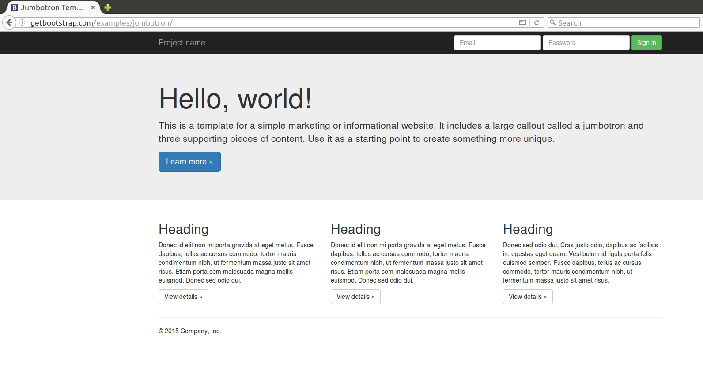
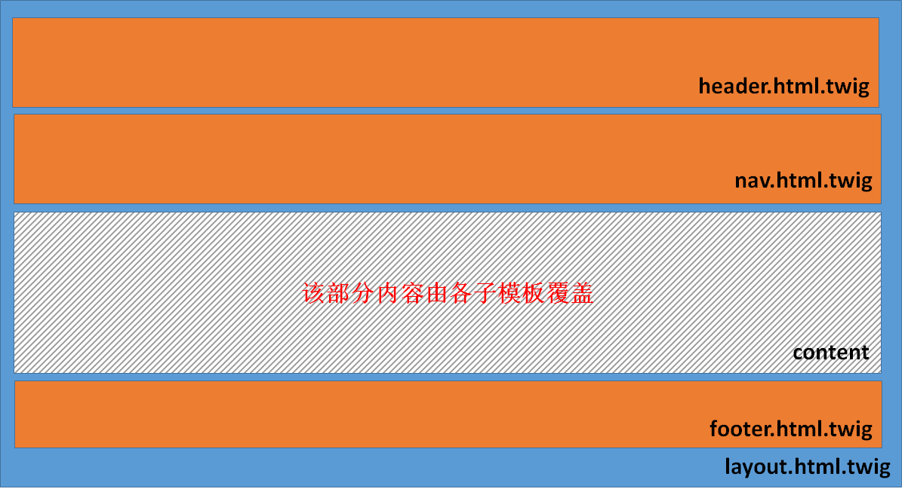

#模板

模板属于MVC结构中的V。它的出现是为了更好地分离程序代码（对用户不可见）HTML呈现（用户可见）。

对模板开发者的要求是能掌握一些基本的模板语法，写出基本框架，加入对应的控制和输出，最终形成一个可以呈现给用户的页面。

##SF模板引擎：Twig

SF的创始人Fabien Potencier研制了一个全新的模板引擎：[Twig](http://twig.sensiolabs.org/) 。我很喜欢这个引擎。我个人认为它有这么几个优点：

1. 语法简单，上手快；
2. 支持嵌套、继承等模板高级特性；
3. 扩展性好，可以开发Twig插件扩充功能；
4. 编译速度快，效率高。

Twig是SF框架中的一个部件，也可以独立被其它框架使用。在SF应用创建后，已经支持Twig。

##页面结构的设计

我们的应用不会只有一个页面，但是众多页面却可能有着相同的布局。比如，都采用“顶部导航栏+中间内容+底部导航栏”的上中下布局，或者采用“左导航栏+中间内容+底部导航栏”的布局，等等等等。

我一般会采用基于[Bootstrap](http://getbootstrap.com/)的模板加以定制。我现在[任氏有无轩]( https://rsywx.net)  使用的是从[WrapBootstrap](https://wrapbootstrap.com/) 上购买的一个商业模板。在本应用开发中，我们会用一个免费的Bootstrap模板，[Jumbotron](http://getbootstrap.com/examples/jumbotron/)：

 

这个页面布局很合适我们的应用。

1. 顶部的黑色导航区可以放应用名称，导航链接，右边的用户登录部分可以用搜索框来代替；
2. 下面的Jumbotron部分可以用在某些页面中作为强调部分；
3. 主内容区三个并排的列可以在首页中显示不同栏目的内容，也很方便变成一个列用在别的页面中；
4. 最下面的一块地方正好可以用来显示一些版权信息之类的。

为了在我们的应用中使用这个布局，我们需要做一些额外的工作。

##保存Bootstrap模板

我们首先要将Jumbotron这个页面保存下来。在浏览器中选择保存页面。如果有选择保存方式的话，选择“全部”。这样我们保存的就不仅是该页面的HTML文件，而且包括该HTML页面中引用到的CSS，JS和图片文件等。

在我们SF项目的`web`目录下创建几个目录，如`css`，`js`，`img`，将保存下来的页面引用到的CSS，JS和图片文件分别拷贝到对应的目录中去。

接着，我们将刚才保存的那个HTML文件移到`src/AppBundle/Resources/views/default`并改名为`layout.html.twig`。

##修改首页显示该模板

下一步，我们修改当前首页所渲染的模板，使其显示我们刚才创建的模板，这样方便我们进一步修改该模板并看到效果。

让我们修改`src/AppBundle/Controller/DefaultController.php`中的`indexAction`为：

```
    public function indexAction(Request $request)
    {
        // replace this example code with whatever you need
        return $this->render('AppBundle:default:layout.html.twig');
    }
```
刷新我们的应用页面，可以看到Bootstrap的页面已经替换了原来的SF欢迎页面。但是由于该页面中引用的CSS、JS文件的相对路径已经发生变化，所以需要进行调整。具体怎样调整这里就不再赘述，原则上只是一些文件路径和文件名的调整罢了。

如果一切顺利，我们应该看到和之前在Bootstrap上一样的页面效果。

##模板的继承和包含

Twig模板引擎的一个强大之处在于它支持模板的继承和包含，而且还可以嵌入控制器[^1]。这为我们定义灵活的页面布局并同时保持一致性提供了方便。

###包含

包含是include，它并不是Twig的重点，所以我们只是提一下。它用来在一个模板中导入另一个模板。通常情形下，那些相对固定且在多个页面中都会重复出现的内容比较适合被剥离到一个单独的模板文件中。在需要这些内容的地方加以导入即可。

考虑我们使用的Bootstrap样板，我们会很快地发现，顶部导航栏和底部的导航栏都具有这样的性质：相对固定、作为页眉和页脚也会在多个页面重复出现。所以，这两部分可以被提取出去作为一个独立的模板供其它模板使用。

###继承

Twig的强大之处在于模板的继承。

学习过OOP的一定知道类继承是怎样的机制。简单地说，子类继承了父类中所有公共特性和公共方法，同时也可以按照子类的特殊要求加入新的特性和方法。

Twig模板的继承与此也有类似之处。不过由于我们讨论的是页面布局，所以这里的继承也是对页面布局的继承。

根据上面对Bootstrap样板的分析，我们可以看到，以页面布局来看，我们的页面基本上有三个部分：

1. 顶部导航栏，我们不妨称之为"`nav`[^2]"。
2. 中间的内容部分，我们不妨称之为"`content`"。
3. 底部的信息栏，我们不妨称之为"`footer`"。

这三部分中，1/3我们已经讨论过了，我们需要将它们独立出去，成为两个独立的模板供包含。

2这部分是非常动态的，各个不同页面要显示的主要内容肯定不同。所以，它也必须独立出去，由各个页面各自完成。

于是我们可以对主模板进行如下图所示的调整：



简要说明一下：

1. 原本的`layout`模板被拆分为四块：`header`，`nav`，`index`，`footer`。
2. `index`模板成为我们首页最终使用的模板，它将继承`layout`模板，并用属于该页面的内容覆盖`content`页面组块。
3. 其它三个模板分别在`layout`模板中被引用。

随着应用的开发，我们会创建更多的页面。但是，其创建方式和创建`index`页面的方式类似。

##Twig简明语法

Twig的语法很简单。原则上说，只有两种。一种是“内容显示语句”，一种是“控制语句”。

内容显示语句以`{{...}}`的形式出现。

Twig显示内容夜可以访问变量，甚至可以访问对象中的属性。变量和对象都是通过控制器传递过来的。

```
{{bookcount}}
{{book.title}}
{{array.index.property}}
```

**注意**：Twig中所有用到的变量、对象都必须显式赋值。

控制语句用来控制流程以及进行一些特别的工作，比如赋值，循环，条件，引用模板，扩展模板等。这些语句的详细说明会在各个页面创建的时候进行。

##Twig模板中的`block`

可以这么说，block（块）是Twig模板构造页面的基础。

在`layout`模板中，我们会注意到这么一段：

```
<html lang="zh">
    

    <body>

        

        

        
    </body>
</html>

```

``在`layout`模板中定义了一个名为`content`的块。我们注意到，`layout`中这个块中没有任何内容。它的内容是由各个具体的页面填充的，比如在`index`模板中：

```



    <div class="jumbotron">
    ... ...        
    </div> <!-- /container -->

```
首先，`index`模板声明它会扩展（也就是继承自）`layout.html.twig`模板。因此，所有在`layout`模板中出现的布局因素（包括`layout`需要引用的其它模板）也都会在`index`中出现。

但是，`index`模板重写了`content`块，替换成自己的内容。而`index`模板中未覆盖的那些块，会仍然采用`layout`中的相应内容。

这样的一个过程，正是继承的过程。

一般而言，每当我们要创建一个新的页面，我们会采用类似的方式：

1. 从主模板（本例中的`layout`）继承；
2. 重写相应的块。一般而言，也就是一个诸如名为`content`的块；
3. 根据需要，重写另外的一些块，比如`title`，`extralink`，`extrajs`等以达到高度定制的目的。

##Twig模板的存放位置

缺省情况下，所有的Twig模板文件都应该存放在`src/AppBundle/Resources/views`之下。为了更方便的组织模板文件，我们可以在这个目录之下再创建一些子目录。

引用一个模板的时候，无论是在模板之中还是在控制器之中，方法都是类似“`AppBundle:目录:模板`“的格式。比如，`AppBundle:default:nav.html.twig`对应的模板文件是`src/AppBundle/Resources/views/default/nav.html.twig`文件。


[^1]: 在模板中嵌入控制器是高级用法，但是其语法却非常简明。我们在后续章节会看到详细讲解。

[^2]: 我们没有把它叫做`header`是因为我们还会有一个`header`的模板，用来统一管理HTML页面中的头信息（如`meta`，CSS/JS的引用等）。