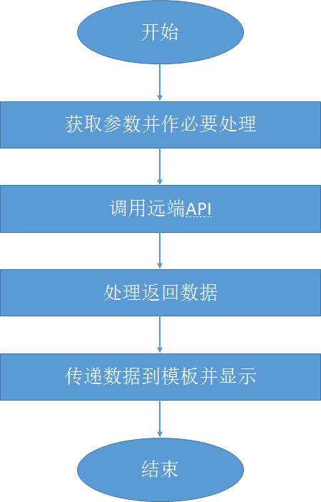

# 首页的编写

由于本站点采用了新的架构（即不再应用中包含数据的CRUD操作，而改为调用对应的RESTful API的方式），因此站点编写工作量大大降低。

SF基于MVC架构，所以编程部分在C部分，也就是控制器（Controller）部分。

一个常规控制器的流程如下：



我们之所以首先用首页来进行控制器编写的说明，主要是因为它是一个站点的入口，具有特别重要的地位，而且它往往独一无二与别的页面不同（别的页面如书籍详情等会重复）。另外，首页中也用到控制器嵌入等重要技术，值得首先加以描述。

## 顶端项目栏和搜索框

### 创建一个新的路由

首页的顶端我们要设计成项目名称和搜索框。修改的是`AppBundle:default:nav.html.twig`文件，并最终呈现在`AppBundle:default:index.html.twig`的渲染效果中。

既然是搜索栏，我们要为搜索这个动作设定一个路由。出于简化编程和示范的目的，我们约定搜索只搜索书籍。我们修改`src/AppBundle/Resources/config/routing.yml`并增加一个新的路由如下：

```
books_search:
  path: /books/search
  defaults: {_controller: AppBundle:Book:search}
  requirements:
    _method: POST
```

### 创建一个新的控制器

从路由的设置我们看到，我们同时要创建一个新的控制器（`BookController`）并在其中创建一个搜索的方法(`searchAction`）来处理这个工作。

创建新的控制器很简单，我们可以简单地从`DefaultController.php`出发，将其拷贝黏贴为`BookController.php`，并作相应修改：

```
<?php

namespace AppBundle\Controller;

use Sensio\Bundle\FrameworkExtraBundle\Configuration\Route;
use Symfony\Bundle\FrameworkBundle\Controller\Controller;
use Symfony\Component\HttpFoundation\Request;

class BookController extends Controller
{
    /**
     * Test changes in Linux
     */
    public function searchAction(Request $request)
    {
        // replace this example code with whatever you need
        dump($request);
        die();
    }
}
```
简单说明如下：

1. 这个控制器的代码并未完成，我们只是将通过表单提交的数据简单地加以显示而已。该方法的具体实现需要借助于别的尚未完成的模板，所以我们这里进行了简单处理。

### 修改`nav.html.twig`

至此，我们可以修改`nav.html.twig`文件如下：

```
<nav class="navbar navbar-inverse navbar-fixed-top">
    <div class="container">
        <div class="navbar-header">
            <button type="button" class="navbar-toggle collapsed" data-toggle="collapse" data-target="#navbar" aria-expanded="false" aria-controls="navbar">
                <span class="sr-only">Toggle navigation</span>
                <span class="icon-bar"></span>
                <span class="icon-bar"></span>
                <span class="icon-bar"></span>
            </button>
            <a class="navbar-brand" href="{{path('home')}}">任氏有无轩</a>
        </div>
        <div id="navbar" class="navbar-collapse collapse">
            <form class="navbar-form navbar-right" action="{{path('books_search')}}" method="POST">
                <div class="form-group">
                    <input type="text" placeholder="书籍名称" class="form-control" name="key">
                </div>
                <button type="submit" class="btn btn-success">搜索</button>
            </form>
        </div><!--/.navbar-collapse -->
    </div>
</nav>
```
简单说明如下：

1. 我们修改了项目名称为“任氏有无轩”。
2. 我们为表单提供了`action`和`method`参数。
3. 我们使用了Twig专用的辅助函数`path`来为制定表单指定动作。它指向我们在上一步定义的`books_search`路由。
4. `method`只是简单的定义为POST。
5. 我们为一个文本输入框定义了一个名字为`key`。

我们刷新一下页面，会看到如下效果：


而如果我们在“书籍名称”框中输入一些文字并点击“搜索”后会出现如下界面（部分分支已展开）：


可见，`VarDump`包中提供的`dump`函数能比PHP内置的`var_dump`函数更有组织地、更灵活地显示一个变量的值。从图中也能看到，我们通过表单提交的变量（`key`）获得了正确的赋值。

## Jumbotron的编写

顶端项目栏和搜索栏之下是所谓的Jumbotron部分。这是首页特有的内容。在本应用中，我们用来显示最近购买的一本书。

要显示最近购买的一本书，有两种做法。一种是在所谓的`Default:indexAction`中直接获取最新的一本书，并将代表这本书的对象直接传递给模板；另外一种是在模板中嵌入一个控制器，让控制器获取相应的最新图书并显示。在Jumbotron的编写中我们采用第二种方式。

我们首先编写控制器如下：

```
public function latestAction()
{
    $b= json_decode(file_get_contents('http://api/book/latestBook'));

    return $this->render("AppBundle:book:latest.html.twig", ['book' => $b->out[0]]);
}
```
由于我们采用了API调用，这个控制器可以写得非常简单。

### `latest.html.twig`模板

我们可以简单地将当前`index.html.twig`模板中Jumbotron的`<div>...</div>`部分提取出来，成为`latest.html.twig`模板的基础，并进行一些修改。此时，我们从控制器的编写中可以看到，该模板会使用到一个`book`变量。

```
<div class="jumbotron">
    <div class="container">
        <div class="row">
            <div class="col-md-8">
                <h1>{{book.title}}</h1>
                <p>作者：{{book.author}}（{{book.region}}）</p>
                <p>收录时间：{{book.purchdate|date('Y年m月d日')}}</p>
                <p>版次：{{book.ver}}</p>
                <p><a class="btn btn-primary btn-lg" href="{{path('book_detail', {'id':book.bookid})}}" role="button">浏览本书 &raquo;</a></p>
            </div>
            <div class="col-md-4">
                
            </div>
        </div>
    </div>
</div>
```

注意如下几点：

1. 我们这里用Bootstrap布局来安排我们的书籍信息部分和书籍封面部分，左右分列。
2. 所有的书籍信息的显示都来自从控制器传递过来的`book`变量。
3. 我们再次用到`path`函数来构造浏览书籍详情的连接。这里我们还为该路径提供了一个参数，请读者必须注意参数传递的方式：`{'id':book.bookid}`。
4. 暂时我们用一个缺省的书籍封面作为所有书籍的封面。在后续章节中，我们还会进一步编写一个方法来显示书籍封面。  

### `index.html.twig`的修改

最后，我们修改`index.html.twig`，用嵌入控制器的方式替代原来的Jumbotron的`<div>...</div>`部分：

```

    {{ render (controller('AppBundle:Book:latest')) }}

    <div class="container">
    ... ...
```
此处我们用到Twig的一个高级语法`render`，它用来嵌入一个从控制器的返回。

### 效果

让我们保存所有修改，然后重新刷新首页页面：


由于我们对“最新登录书籍”的定义是按照其ID，所以我们会看到之前在样本数据填充中最后生成的书籍记录会被选出。


