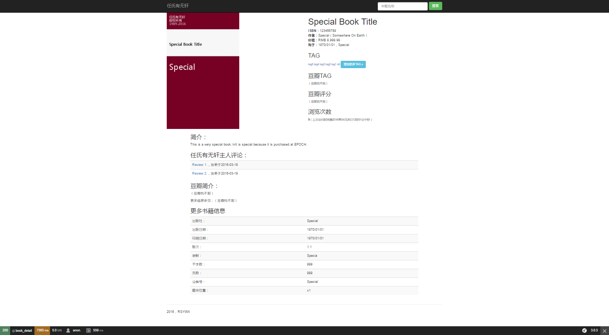

# 书籍详情页面

第二个我们要详细解释的页面编程是书籍详情。

在该页面中我们要显示很多东西：书籍的所有登陆信息，包括TAG，一个jQuery的表单方便访客增加自己的TAG，如果这本书有相关的评论，那么还要显示评论的连接等等等等。该页面编程量非常大，请做好准备。

## 创建`detail.html.twig`页面

这个页面很长，我这里就不贴出全部的代码了。同时我也不会写出所有的步骤：一般而言，SF给出的错误提示是非常精确的。在过程中参考错误提示，不断地修订——增加路由，控制器方法，模板等，最终一定能调试通过。

我们贴一张最终渲染的效果图：

我们分别来看几个重要的版块。

## 显示书籍封面图片

我们这里要显示的书籍封面图片，以JPG图片格式保存在`web/covers`目录之下，每本书都对应一个图片，其格式是`{{bookid}}.jpg`，例如途中所示的书其`bookid`为`99999`，那么它对应的封面图片应该是`99999.jpg`。如果该文件名的图片不存在，我们将显示一个`default.jpg`。

但是我们不是简单地显示图片，而是要加一个水印。同时，对于缺省图片，我们需要根据必要的书籍信息（书名、作者）在缺省图片上显示。因此，虽然只有一个缺省图片，其最终效果是动态的。

我们先看其路由定义：

~~~
cover: 
  path: /books/cover/{id}_{title}_{author}_{width}.png
  defaults: {_controller: AppBundle:Default:cover, width: 300}   	
  requirements:
      title: .+
~~~

从路由定义我们可以看到，我们的图片是动态生成的。

再看对应的动作，我们将其放置在`DefaultController`中的`cover`动作中：

~~~
public function coverAction($id, $title, $author, $width)
    {
        // Construct image file name based on 
        $path = 'covers/';
        $ext = '.jpg';
        $filename = $path . $id . $ext;

        $default = false;

        // Check if the file exists
        if (!file_exists($filename))
        {
            $filename = $path . 'default' . $ext;
            $default = true;
        }

        list($w, $h) = getimagesize($filename);

        $nw = 300;
        $nh = $nw / $w * $h; // Propotionally change the width/height
        // Resize image
        $oimg = imagecreatefromjpeg($filename);
        $nimg = imagecreatetruecolor($nw, $nh);

        imagecopyresampled($nimg, $oimg, 0, 0, 0, 0, $nw, $nh, $w, $h);

        // Print copyright texts
        $copytext1 = "任氏有无轩";
        $copytext2 = "版权所有";
        $copytext3 = "1989-" . date("Y");

        $color = imagecolorallocate($nimg, 255, 255, 255);
        $color2 = imagecolorallocate($nimg, 0, 0, 0);
        $font = $path . 'msyh.ttf';

        imagettftext($nimg, 10, 0, 10, 26, $color, $font, $copytext1);
        imagettftext($nimg, 10, 0, 10, 40, $color, $font, $copytext2);
        imagettftext($nimg, 10, 0, 10, 54, $color, $font, $copytext3);

        if ($default)
        {
            //Print title
            imagettftext($nimg, 12, 0, 10, 140, $color2, $font, $title);
            // Print author
            imagettftext($nimg, 24, 0, 10, 240, $color, $font, $author);
        }

        //Resize the image to fit into reading list
        if ($width <> 300) //300 is the image width for book detail
        {
            $height = $width / $nw * $nh;

            $timg = imagecreatetruecolor($width, $height);
            imagecopyresampled($timg, $nimg, 0, 0, 0, 0, $width, $height, $nw, $nh);
        }
        // Output the image
        header('Content-type: image/png');
        if ($width == 300)
        {
            imagepng($nimg, null, 9);
        }
        else
        {
            imagepng($timg, null, 9);
        }
        imagedestroy($nimg);
        imagedestroy($oimg);
        imagedestroy($timg);
    }
~~~

这段代码比较长，用到了PHP的GD扩展对图片进行操作。但是流程还是比较直观，请读者自行分析。

**注意：**图片处理过程中要用到字体文件。由于字体文件比较大，作者没有将其放入代码仓库中，请读者自行拷贝。

## 显示TAG并允许用户自行添加TAG

显示TAG的过程比较简单，直接贴代码：

~~~
public function tagsbyidAction($id)
{
    $tags = json_decode(file_get_contents("http://api/book/tagsByBookId/$id"))->out;

    return $this->render("AppBundle:book:tags.html.twig", array('tags' => $tags));
}
~~~
我们用的是嵌入控制器的方式，所以对应的模板中代码如下：

~~~
<small>{{ render (controller('AppBundle:Book:tagsbyid', {"id":book.id})) }}</small>
~~~

显示完书籍的TAG后，我们显示一个按钮，让用户能添加自己的TAG：

~~~
<a class="btn btn-info btn-sm" data-toggle="modal" href="#addtag" >增加更多TAG »</a> 
... ...
    <!-- The modal dialog to add more tags -->
    

        

            

                

                    

                        <button type="button" class="close" data-dismiss="modal" aria-hidden="true">&times;</button>
                        <h4 class="modal-title">增加自己的TAG</h4>
                    

                    

                        <form role="form" method="post" action="{{path('tags_add')}}"  id='tagform' name='tagform'>
                            

                                

                                    <label class="control-label" for="newtags">新增TAG</label>
                                    <input type="text" class="input-xlarge" id="newtags" name="newtags" />
                                    
（用空格分隔）

                                    <input type="hidden" value="{{book.id}}" id="id" name="id"/>

                                

                            

                            

                                <a href="#" class="btn" data-dismiss="modal">取消</a>
                                <button type="submit" class="btn btn-primary">保存</button>
                            

                        </form>
                    

                

            

        

        <!-- Example row of columns -->
    

~~~
这是标准jQuery的模态对话框。我们不进行特别的分析。只是提请大家注意表单的编写方式。

## 获取豆瓣信息

我们希望从第三方（豆瓣）获取书籍的一些信息（TAG、介绍、评分等）。这里我们要用到已经用了很多次的`file_get_contents`函数：

~~~
	public function detailAction($id, Request $request)
    {
        $logger = $this->createLogger();

        $books = json_decode(file_get_contents("http://api/book/bookByBookId/$id"))->out;

        if (count($books) == 0) // Book not found
        {
            return $this->render("AppBundle:book:BookNotFound.html.twig", array('bookid' => $id));
        }
        $book = $books[0];
        $isbn = $book->isbn;
        $douban = json_decode(file_get_contents("http://api/douban/douban/$isbn"))->out;

        if ($douban->summary == '（豆瓣找不到）')
        {
            $logger->addError('豆瓣找不到ISBN ' . $book->isbn . '的书：' . $book->title);
        }
        else
        {
            $logger->addInfo('豆瓣找到ISBN ' . $book->isbn . '的书：' . $book->title);
        }

        $lvt = json_decode(file_get_contents("http://api/book/lastvisit/" . $book->bookid))->out;

        $session = $request->getSession();
        $count = $session->get('addvc', 1);
        $session->remove('addvc');

        $vc = json_decode(file_get_contents("http://api/book/visitCount/" . $book->id . "," . $count))->out;
        return $this->render("AppBundle:book:detail.html.twig", array('book' => $book, 'douban' => $douban, 'vc' => $vc, 'lvt' => $lvt));
    }
~~~

注意到我们此时用的是传递变量到模板的方式。但是方法本身全部采用RESTful API调用的方式。

## 获得相关评论

基于我们的样本数据，这本书应该有2个评论文章。所以我们还要获取相应的评论并显示。该段代码比较简单，请读者自行完成。

## 小结

至此，我们已经基本完成书籍详情页面的编写。

请读者认真学习本段，因为本段牵涉到的代码量是非常大的。