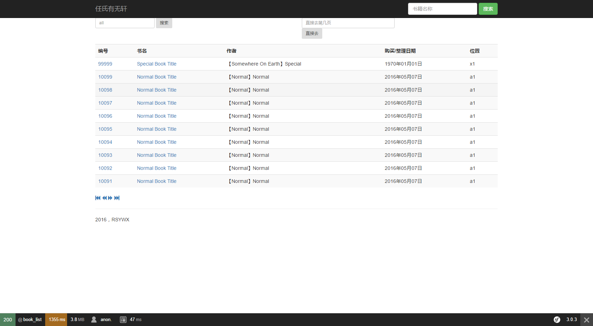

# 书籍列表页面

在这个页面，我们会分页显示书籍列表页面。同时我们也会看到，SF中一个模板是可以被多个控制器复用的。当然，我们还要讨论如何编写分页。

## 分页模块

首先我们看看分页模块的编写。

在`src`目录下创建一个`lib`目录，并创建一个`Paginator.php`：

~~~
namespace lib;

class Paginator
{
    private $totalPages;
    private $page;
    private $rpp;

    public function __construct($page, $totalcount, $rpp)
    {
        $this->rpp=$rpp;
        $this->page=$page;

        $this->totalPages=$this->setTotalPages($totalcount, $rpp);
    }

    /*
     * var recCount: the total count of records
     * var $rpp: the record per page
     */

    private function setTotalPages($totalcount, $rpp)
    {
        if ($rpp == 0)
        {
            $rpp = 20; //This is forced in this. Need to get parameter from configuration but seems not necessary
        }

        $this->totalPages=ceil($totalcount / $rpp);
        return $this->totalPages;
    }

    public function getTotalPages()
    {
        return $this->totalPages;
    }

    public function getPagesList()
    {
        $pageCount = 5;
        if ($this->totalPages <= $pageCount) //Less than total 5 pages
        {
            return [1, 2, 3, 4, 5];
        }
        if($this->page <=3)
        {
            return [1,2,3,4,5];
        }

        $i = $pageCount;
        $r=array();
        $half = floor($pageCount / 2);
        if ($this->page + $half > $this->totalPages) // Close to end
        {
            while ($i >= 1)
            {
                $r[] = $this->totalPages - $i + 1;
                $i--;
            }
            return $r;
        } else
        {
            while ($i >= 1)
            {
                $r[] = $this->page - $i + $half + 1;
                $i--;
            }
            return $r;
        }
    }

}
~~~
这个模块只负责一件事情：根据记录总数和每页的记录数算出总页面，并根据当前页数返回一个（合理的）包含前后各2个页数及当前页数（共5个）的数组，使得调用端可以显示去往不同页面的链接。这个类的编写并不复杂，这里不再做进一步的解释。

## 书籍列表的路由定义

书籍列表的路由定义比较长，这是因为在设计这个路由（和对应的动作）时，我们考虑要将该路由（和对应的动作）复用。它不仅只是简单地按照登录顺序的逆序分页显示若干书籍，而且还能按照搜索方式的不同只显示符合搜索条件的若干书籍[^1]。

该路由定义如下：

```
book_list:
    path: /books/list/{type}/{key}/{page}
    defaults:
        page: 1
        type: title
        key: all
        _controller: AppBundle:Book:list
```
这个路由定义的路径可以解读为：按照某个类型（`type`）下的关键字(`key`)搜索并返回搜索结果中的某一页（`page`）。

## 书籍列表动作的编写

由于我们采用API的方式获得远程数据，所以控制器中的动作编写相对简单：

~~~
public function listAction($page, $key, $type)
{
    $uri="http://api/books/list/$type/$key/$page";
    $out=  json_decode(file_get_contents($uri))->out;

    $res=$out->books;
    $totalcount=$out->count->bc;

    $rpp=$this->container->getParameter('books_per_page');

    $paginator = new \lib\Paginator($page, $totalcount, $rpp);
    $pagelist  = $paginator->getPagesList();

    return $this->render("AppBundle:book:list.html.twig", array('res' => $res, 'paginator' => $pagelist, 'cur' => $page, 'total' => $paginator->getTotalPages(), 'key' => $key, 'type' => $type));
    }
~~~    
简单说来，我们通过API调用获得适当的数据（符合搜索条件的书籍和书籍总数），从SF全局配置文件中获得`books_per_page`这个参数并调用上文提到的`Paginator`类构造一个分页列表。最后将相应的参数（共6个）传递到模板中显示。

** 注意： ** `books_per_page`参数应该在`/app/config/parameters.yml`中得到定义。方法是在该文件中加入一行：

~~~
books_per_page: 20 
~~~

## 书籍列表模板

书籍列表模板比较长，这里不再列出。我们只是重点分析一下分页导航部分的代码。

~~~
<section id="pagination" class="col-md-12">
    <a href="{{path('book_list', {'page':1, 'key':key, 'type':type})}}" title="首页"><i class="glyphicon glyphicon-fast-backward"></i></a>
    
    <a class="disabled" title="上一页"><i class="glyphicon glyphicon-backward"></i></a>
    
    <a href="{{path('book_list', {'page':cur-1, 'key':key, 'type':type})}}" title="上一页"><i class="glyphicon glyphicon-backward"></i></a>
    
    
    <a class="disabled" title="下一页"><i class="glyphicons forward"></i></a>
    
    <a href="{{path('book_list', {'page':cur+1, 'key': key, 'type':type})}}" title="下一页"><i class="glyphicon glyphicon-forward"></i></a>
    
    <a href="{{path('book_list', {'page':total, 'key':key, 'type':type})}}" title="末页"><i class="glyphicon glyphicon-fast-forward"></i></a>
</section>
~~~

虽然说从`Paginator`获得的是一个页面导航列表，但是我们选择用“前后页”（加上首页、末页）的方式显示导航按钮。也因此，我们分离了分页本身、导航、显示这三部分。这样做能提供最大程度的灵活性。

## 效果

至此页面效果如下：



当然，这个页面还有一些功能没有完成。比如搜索以及直接跳转页面。搜索会在后续章节讲述。直接页面跳转比较简单，请自行完成。


[^1]: 目前只支持按照书籍标题起始字符搜索和单一TAG搜索。
