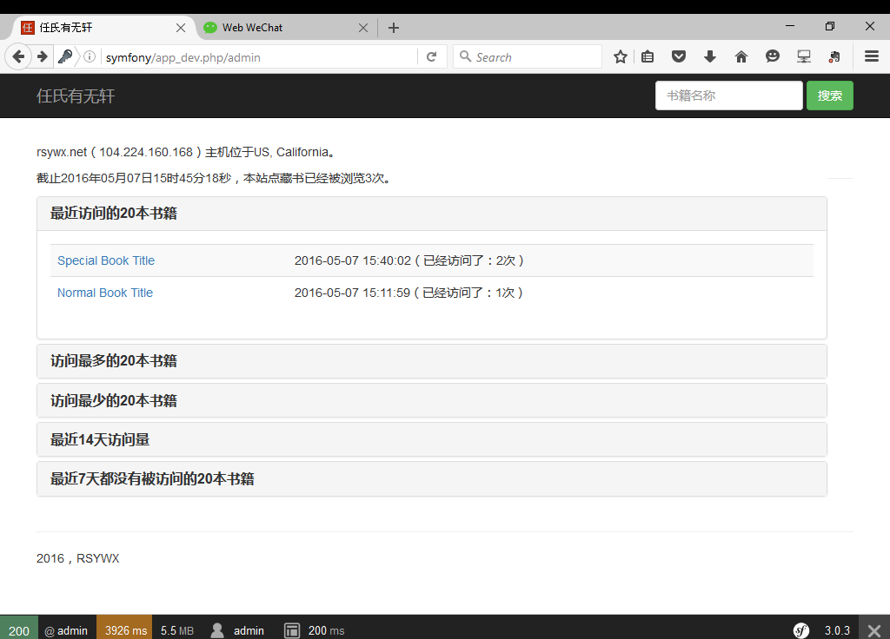

# 用户及后台

我们在之前的章节已经看到如何开发一个WEB应用。严格的说，那只是前台的应用。

一般而言，我们总还有一个后台的应用，而后台的应用一般也会要求用户登录。

所以在本章，我们详细讲述用户和后台的开发。

## 用户

SF中的用户概念和常规应用中的没有什么不同。对用户的验证也有多种方法。详情可以参考[SF官方文档中的相关章节](http://symfony.com/doc/current/book/security.html)。

在本应用中，我们只采用最简单的所谓Plain Authorization，而且用户及密码都以明文保存在配置文件中。

## `security.yml`

SF所有的安全配置都在`/app/config/security.yml`中，我们将该文件修改为：

~~~
security:
    encoders:
        Symfony\Component\Security\Core\User\User: plaintext

    providers:
        in_memory:
            memory:
                users:
                    admin: { password: 123456, roles: [ 'ROLE_ADMIN' ] }

    firewalls:
        dev:
            pattern:  ^/(_(profiler|wdt)|css|images|js)/
            security: false

        login:
            pattern:  ^/demo/secured/login$
            security: false

        secured_area:
            pattern:    ^/admin
            anonymous: ~
            http_basic:
                realm: "Secured RSYWX Admin Area"

    access_control:
        - { path: ^/admin, roles: ROLE_ADMIN }
~~~

我们略作解释。

* `encoders`一段中，说明我们的用户验证机制是plaintext，也就是明文的方式。
* `providers`一段中，说明我们的用户是`in memory`方式，也就是说用户信息存放在内存中。
* `firewalls`中，主要看`secured_area`中`pattern`的说明。`^/admin`表示类似`'/admin'`这样的路径是属于受控路径，需要验证。
* `access_control`中，我们规定类似`/admin`这样的目录只能由具有`ROLE_ADMIN`权限的用户访问。

这里我们略微讲一下验证和授权的区别。

验证是对一个用户是否合法的判定。常规情形下，一个用户用正确的密码登录系统后，就认为该用户已经获得验证。

授权是对一个验证用户的进一步判定。在应用配置中，该用户能做什么不能做什么是由授权来完成的。

## 后台

本应用的后台只是一些统计信息的显示。具体编程不再赘述，显示效果如下：

如果配置正确的话，在访问该页面之前，浏览器会弹出一个对话框，要求输入用户/密码（我们的配置是admin/123456）。

